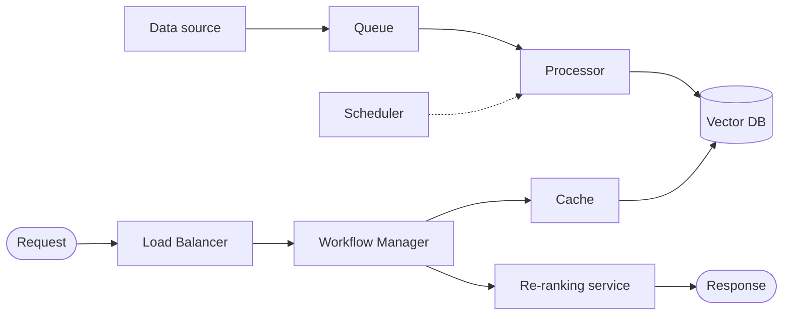

# ML-HLD Gemini CLI Skill — Implementation Plan

> **For agentic workers:** REQUIRED SUB-SKILL: Use superpowers:subagent-driven-development (recommended) or superpowers:executing-plans to implement this plan task-by-task. Steps use checkbox (`- [ ]`) syntax for tracking.

**Goal:** Build a Gemini CLI extension `hld-ml-designer` that turns a one-line ML task into approved FR/NFR and then a markdown+Mermaid High-Level Design, by matching requirements against a reusable component catalog.

**Architecture:** One Gemini CLI extension bundling (a) one Agent Skill `ml-system-hld` holding the design methodology + reference knowledge (component catalog, patterns, examples) and asset templates, and (b) two namespaced slash commands `/hld:requirements` and `/hld:design` as explicit entry points. Progressive disclosure: `SKILL.md` stays short and points into `references/` which Gemini loads only when designing.

**Tech Stack:** Gemini CLI (extensions, Agent Skills `SKILL.md`, TOML custom commands), Markdown, Mermaid, JSON manifest. No runtime code / no package manager.

## Global Constraints

- **Target Gemini CLI only** — no Claude/OpenAI tooling, no MCP servers required.
- **Output artifact = Markdown with embedded Mermaid** — no draw.io/XML in v1.
- **Two-step flow** — `/hld:requirements` writes `requirements.md`; `/hld:design` reads it and writes `hld.md`. Never skip requirements.
- **Extension root:** `D:\Work\04.Personal\GDG\hld-ml-designer\` (its own folder; GDG is the git repo, root `D:/Work/04.Personal/GDG`).
- **SKILL.md frontmatter** must be first in the file, with `name` (matching dir `ml-system-hld`) and a keyword-rich `description` (Gemini triggers the skill from it).
- **Command TOML** required field `prompt`; namespacing via `commands/hld/<x>.toml` → `/hld:<x>`.
- **Reusable blocks (canonical names, use verbatim everywhere):** `Load Balancer`, `Workflow Manager`, `Queue`, `Cache`, `Vector DB`, `Feature Store`, `Model / Embeddings`, `Re-ranking service`, `Scheduler`, `Rights check`, `DLQ → Review`, `Model API Proxy`.
- **Commit after each task**, conventional-commit messages, end body with the Co-Authored-By trailer.

---

## File Structure

```
hld-ml-designer/
├── gemini-extension.json                       # Task 1 — manifest
├── README.md                                    # Task 1 (stub) → Task 8 (full)
├── skills/
│   └── ml-system-hld/
│       ├── SKILL.md                             # Task 6 — methodology (core)
│       ├── assets/
│       │   ├── requirements-template.md         # Task 2 — FR/NFR contract
│       │   └── hld-template.md                  # Task 2 — output contract
│       └── references/
│           ├── component-catalog.md             # Task 3 — 12 blocks
│           ├── patterns.md                      # Task 4 — master + 5 archetypes
│           └── examples.md                       # Task 5 — 5 few-shot systems
└── commands/
    └── hld/
        ├── requirements.toml                    # Task 7 — /hld:requirements
        └── design.toml                          # Task 7 — /hld:design
```

**Responsibilities:**
- `gemini-extension.json` — declares the extension so Gemini loads the skill + commands.
- `SKILL.md` — the "how to think" loop; references do the heavy lifting.
- `assets/*.md` — the two data contracts (input requirements shape, output HLD shape) that both the skill and the commands point at.
- `references/*.md` — the reusable knowledge (catalog, patterns, worked examples).
- `commands/hld/*.toml` — thin entry points that set the task and defer to the skill.

---

### Task 1: Extension skeleton + manifest

**Files:**
- Create: `hld-ml-designer/gemini-extension.json`
- Create: `hld-ml-designer/README.md` (stub)

**Interfaces:**
- Produces: a loadable extension named `hld-ml-designer` (referenced by every later task's paths).

- [ ] **Step 1: Create the manifest**

`hld-ml-designer/gemini-extension.json`:

```json
{
  "name": "hld-ml-designer",
  "version": "0.1.0",
  "description": "Generate ML/AI system High-Level Designs (markdown + Mermaid) from functional and non-functional requirements.",
  "contextFileName": "GEMINI.md"
}
```

Note: `GEMINI.md` is intentionally NOT created — `contextFileName` is harmless if absent, and we deliberately keep knowledge in the skill (progressive disclosure), not always-on context. Leave the key so it is trivial to add a global banner later.

- [ ] **Step 2: Create README stub**

`hld-ml-designer/README.md`:

```markdown
# hld-ml-designer

Gemini CLI extension: turn a one-line ML task into requirements, then a
High-Level Design (markdown + Mermaid).

Status: work in progress. Full install/usage instructions land in Task 8.
```

- [ ] **Step 3: Register the extension locally**

Run:
```bash
cd "D:/Work/04.Personal/GDG/hld-ml-designer" && gemini extensions link .
```
Expected: success message; if `link` is unavailable on the installed version, use `gemini extensions install .` instead.

- [ ] **Step 4: Verify it loads**

Run:
```bash
gemini extensions list
```
Expected: output includes `hld-ml-designer` with version `0.1.0`.

- [ ] **Step 5: Commit**

```bash
cd "D:/Work/04.Personal/GDG" && git add hld-ml-designer/gemini-extension.json hld-ml-designer/README.md && git commit -m "feat: scaffold hld-ml-designer extension manifest"
```

---

### Task 2: Asset templates (input + output contracts)

**Files:**
- Create: `hld-ml-designer/skills/ml-system-hld/assets/requirements-template.md`
- Create: `hld-ml-designer/skills/ml-system-hld/assets/hld-template.md`

**Interfaces:**
- Produces: `requirements-template.md` (the exact FR/NFR shape the `/hld:requirements` command fills and `/hld:design` reads) and `hld-template.md` (the exact section order of the output HLD). Tasks 6 and 7 reference these paths.

- [ ] **Step 1: Write the requirements template**

`skills/ml-system-hld/assets/requirements-template.md` — verbatim:

```markdown
# Requirements: <system name>

## Problem
- **Business problem:** <what hurts today, target metric to move>
- **ML problem:** <the ML task in one sentence>

## Functional Requirements (FR)
- FR1: <capability — API / input / output / language / scenario>
- FR2: ...

## Non-Functional Requirements (NFR)
| NFR | Target | Notes |
|-----|--------|-------|
| Latency (p95) | <e.g. < 300 ms> | |
| Throughput | <e.g. 10,000 QPS / 2,000 items per minute> | |
| Data freshness | <e.g. new items indexed within 1 h> | |
| Availability | <e.g. 99.9%> | |
| Access control | <e.g. per-user document access levels> | |
| Cost / budget | <optional> | |
| Privacy / compliance | <optional> | |

## Out of scope
- <explicitly excluded>
```

- [ ] **Step 2: Write the HLD output template**

`skills/ml-system-hld/assets/hld-template.md` — verbatim:

```markdown
# High-Level Design: <system name>

## 1. Summary
<2-3 sentences: what the system does and the master pattern used.>

## 2. Architecture diagram

```mermaid
flowchart LR
    %% ingestion (offline) on the left, serving (online) on the right
```

## 3. Components
| Component | Role | Which NFR it serves |
|-----------|------|---------------------|
| <block> | <one line> | <NFR> |

## 4. Data flow
1. **Ingestion:** <step by step>
2. **Serving:** <step by step>

## 5. NFR → design rationale
| NFR | Target | How the design meets it |
|-----|--------|-------------------------|
| <nfr> | <target> | <component/mechanism> |

## 6. Open questions / risks
- <thing to validate with the client>
```

- [ ] **Step 3: Verify Mermaid fence is valid**

Run (renders the fenced block to SVG; proves the template's diagram syntax parses):
```bash
npx -y @mermaid-js/mermaid-cli -i skills/ml-system-hld/assets/hld-template.md -o /tmp/hld-template.svg
```
Expected: exits 0, writes `hld-template.svg`. (If `npx`/network unavailable, paste the ```mermaid block into https://mermaid.live and confirm it renders.)

- [ ] **Step 4: Commit**

```bash
cd "D:/Work/04.Personal/GDG" && git add hld-ml-designer/skills/ml-system-hld/assets && git commit -m "feat: add requirements and HLD output templates"
```

---

### Task 3: Component catalog reference

**Files:**
- Create: `hld-ml-designer/skills/ml-system-hld/references/component-catalog.md`

**Interfaces:**
- Consumes: canonical block names from Global Constraints.
- Produces: 12 block cards keyed by the canonical names; Task 4/5/6 reference these blocks by name.

- [ ] **Step 1: Write the catalog with a fixed per-card schema**

Header of `references/component-catalog.md`:

```markdown
# Component Catalog

Reusable HLD building blocks for ML/AI systems. Each card: purpose · when to
include (the NFR it satisfies) · typical tech · how to draw it. Use the exact
block name as the Mermaid node label.
```

Then one card per block using **this exact schema** (worked example for the first block shown in full — reproduce the same 4 fields for every block):

```markdown
## Load Balancer
- **Purpose:** Distribute incoming requests across serving replicas; the single entry point of the serving pipeline.
- **Include when:** any online serving NFR — high throughput (QPS) or availability target.
- **Typical tech:** NGINX, Envoy, cloud L7 LB.
- **Draw as:** rightmost node; external `Request` arrow enters here, then flows to `Workflow Manager`.
```

Produce the remaining 11 cards with these distinguishing values:

| Block | Include when | Typical tech | Draw as |
|-------|--------------|--------------|---------|
| `Workflow Manager` | always (serving) — orchestrates the request | app service / step orchestrator | after LB; fans out to cache, model, re-ranking, rights |
| `Queue` | async ingestion / decoupling / bursty load | Kafka, SQS, RabbitMQ | left side of ingestion; `event` → `Queue` → processor |
| `Cache` | tight latency p95, repeated queries | Redis, GPTCache (semantic) | between Workflow Manager and heavy compute; note "semantic" vs "results" |
| `Vector DB` | similarity search / embeddings retrieval | Elasticsearch, Qdrant, pgvector | center; written by ingestion, read by serving |
| `Feature Store` | recsys / features shared online+offline | Feast, custom | fed by feature-calc jobs; read at serving |
| `Model / Embeddings` | any inference or embedding step | served model / embeddings API | called by processor (ingest) and serving |
| `Re-ranking service` | quality after cheap candidate retrieval | cross-encoder / ranking model | after similarity/candidate step, before response |
| `Scheduler` | periodic/batch reprocessing, freshness by interval | cron, Airflow | drives ingestion/feature-calc on a timer |
| `Rights check` | per-user access control on results | authz service | in serving path before returning docs |
| `DLQ → Review` | model low-confidence needs human-in-the-loop | queue + review UI | branch off processing for low-confidence items |
| `Model API Proxy` | calling external LLM/embeddings providers | LiteLLM / gateway | between internal services and external `LLM Provider` |

- [ ] **Step 2: Verify completeness**

Run:
```bash
grep -c '^## ' skills/ml-system-hld/references/component-catalog.md
```
Expected: `12`.

Run (every card has all 4 fields → 12 of each):
```bash
grep -c 'Purpose:' skills/ml-system-hld/references/component-catalog.md; grep -c 'Include when:' skills/ml-system-hld/references/component-catalog.md; grep -c 'Typical tech:' skills/ml-system-hld/references/component-catalog.md; grep -c 'Draw as:' skills/ml-system-hld/references/component-catalog.md
```
Expected: `12` four times.

- [ ] **Step 3: Commit**

```bash
cd "D:/Work/04.Personal/GDG" && git add hld-ml-designer/skills/ml-system-hld/references/component-catalog.md && git commit -m "feat: add 12-block component catalog"
```

---

### Task 4: Patterns reference

**Files:**
- Create: `hld-ml-designer/skills/ml-system-hld/references/patterns.md`

**Interfaces:**
- Consumes: block names from Task 3.
- Produces: the master pattern + 5 archetype skeletons, each with a valid Mermaid diagram, referenced by Task 6 and Task 5.

- [ ] **Step 1: Write the master pattern with a validated Mermaid skeleton**

`references/patterns.md` opens with:

```markdown
# Patterns

## Master pattern: Indexing ↔ Serving
Almost every ML system splits into an **offline Indexing/Ingestion pipeline**
(prepares data/embeddings/features) and an **online Serving pipeline**
(answers requests). Draw ingestion left→right into a shared store; draw the
request entering from the right through the `Load Balancer`.


```

- [ ] **Step 2: Add the 5 archetype skeletons**

For each archetype below, add a `## <name>` section: one line on when to use it, the block set, and a `mermaid` diagram built ONLY from catalog blocks. Archetypes and their required block set:

1. **Search** — `Queue`,`Scheduler`,`Model / Embeddings`,`Vector DB`,`Cache`,`Load Balancer`,`Workflow Manager`,`Re-ranking service`.
2. **Recommender** — `Feature Store`,`Scheduler`,`Cache`,`Load Balancer`,`Workflow Manager`, candidate-generation `Model / Embeddings`, `Re-ranking service`.
3. **Content-moderation** — `Queue`,`Model / Embeddings`,`DLQ → Review`, storage (`Vector DB`/metadata), publish/review branch.
4. **RAG / GenAI chatbot** — `Model / Embeddings`,`Vector DB`,`Rights check`,`Model API Proxy`,`Workflow Manager`,`Cache`.
5. **Real-time CV** — edge sampling → `Queue`,`Model / Embeddings`,`Cache`,`DLQ → Review`, downstream service.

Model each closely on the corresponding diagram in Task 5's source images (`assets/`).

- [ ] **Step 3: Verify all Mermaid blocks render**

Run:
```bash
awk '/```mermaid/{f=1;next}/```/{if(f){f=0;print "---BLOCK---"}}f' skills/ml-system-hld/references/patterns.md > /tmp/blocks.txt; grep -c BLOCK /tmp/blocks.txt
```
Expected: `6` (master + 5 archetypes). Then paste each block into https://mermaid.live (or run `mmdc` per block) and confirm each renders without a parse error.

- [ ] **Step 4: Commit**

```bash
cd "D:/Work/04.Personal/GDG" && git add hld-ml-designer/skills/ml-system-hld/references/patterns.md && git commit -m "feat: add master pattern and 5 archetype skeletons"
```

---

### Task 5: Examples reference (few-shot)

**Files:**
- Create: `hld-ml-designer/skills/ml-system-hld/references/examples.md`
- Read (source of truth): `D:\Work\04.Personal\GDG\assets\*.png`

**Interfaces:**
- Consumes: templates (Task 2), catalog (Task 3), patterns (Task 4).
- Produces: 5 worked `requirements → HLD` pairs used as few-shot exemplars by Task 6.

- [ ] **Step 1: Transcribe each source diagram into a worked example**

For each of the 5 systems, add a `## Example N: <name>` section containing (a) the requirements filled into the Task-2 template and (b) the finished HLD filled into the Task-2 HLD template with a Mermaid diagram that mirrors the source PNG. Source → example mapping:

1. `Пошукова система.png` → Video Search (500 QPS, p95 < 500 ms, hourly indexing).
2. `Рекомендаційна система.png` + `Рекомендаційна система 2.png` → Housing/Video Recommender (10,000 QPS, p95 < 300 ms, hourly freshness).
3. `Обробка відео та зображень.png` → Image content-moderation (2,000 img/min, publish-or-review ≤ 10 s).
4. `Обробробка відео та зображень2.png` → Smart-cart real-time CV (< 3 s cart latency).
5. `Gen AI.png` + `GenAi.png` → GenAI RAG chatbot + text-to-image (access-aware, English answers).

Keep block names canonical so examples reinforce the catalog vocabulary.

- [ ] **Step 2: Verify structure and diagrams**

Run:
```bash
grep -c '^## Example ' skills/ml-system-hld/references/examples.md
```
Expected: `5`.

Run:
```bash
grep -c '```mermaid' skills/ml-system-hld/references/examples.md
```
Expected: `>= 5`. Spot-check 2 blocks in https://mermaid.live for parse-clean rendering.

- [ ] **Step 3: Commit**

```bash
cd "D:/Work/04.Personal/GDG" && git add hld-ml-designer/skills/ml-system-hld/references/examples.md && git commit -m "feat: add 5 few-shot HLD examples from reference diagrams"
```

---

### Task 6: SKILL.md (core methodology)

**Files:**
- Create: `hld-ml-designer/skills/ml-system-hld/SKILL.md`

**Interfaces:**
- Consumes: `assets/requirements-template.md`, `assets/hld-template.md`, `references/component-catalog.md`, `references/patterns.md`, `references/examples.md` (all must exist — Tasks 2-5).
- Produces: the model-triggered skill that Tasks 7 commands defer to.

- [ ] **Step 1: Write SKILL.md (frontmatter first)**

`skills/ml-system-hld/SKILL.md`:

```markdown
---
name: ml-system-hld
description: Use when designing a high-level architecture (HLD) for an ML or AI system — search, recommendation, content moderation, computer vision, RAG or GenAI. Turns functional and non-functional requirements into a markdown design with a Mermaid diagram by reusing a catalog of standard building blocks. Triggers on "high-level design", "HLD", "system design", "architecture", "ML system", "pre-sale design".
---

# ML System High-Level Design

Produce an HLD as **markdown + a Mermaid diagram** by matching requirements to
reusable blocks. Never invent bespoke boxes when a catalog block fits.

## Inputs and outputs
- Input: an approved `requirements.md` (shape: `assets/requirements-template.md`).
- Output: `hld.md` (shape: `assets/hld-template.md`).

## Design loop
1. **Read the requirements.** Extract: task type (search / recsys / moderation /
   GenAI-RAG / real-time CV), throughput (QPS or items/min), latency budget (p95),
   data freshness, human-in-the-loop need, access control.
2. **Pick the master pattern** from `references/patterns.md` — decide if you need an
   offline Indexing/Ingestion pipeline plus an online Serving pipeline (usually yes),
   and pick the closest archetype skeleton.
3. **Decompose into catalog blocks** from `references/component-catalog.md`. Map each
   NFR to a block: tight p95 → `Cache` + `Load Balancer`; interval freshness →
   `Scheduler`; async/bursty ingest → `Queue`; similarity → `Vector DB`; shared
   features → `Feature Store`; quality → `Re-ranking service`; low confidence →
   `DLQ → Review`; per-user access → `Rights check`; external LLM → `Model API Proxy`.
4. **Assemble the Mermaid diagram**: ingestion left→right into the store; request
   enters from the right through `Load Balancer` → `Workflow Manager` → downstream.
   Use canonical block names as node labels.
5. **Justify**: fill the NFR→design table so every NFR names the block that satisfies it.
6. **Fill `hld.md`** from the output template. Flag anything ambiguous under Open questions.

## Guidance
- Study `references/examples.md` before designing — reuse its shape and vocabulary.
- Prefer fewer, standard blocks. Only add a non-catalog component with a one-line reason.
- Keep the diagram readable: group ingestion and serving; avoid crossing edges where possible.
```

- [ ] **Step 2: Verify frontmatter + reference links resolve**

Run:
```bash
head -5 skills/ml-system-hld/SKILL.md
```
Expected: line 1 is `---`, then `name: ml-system-hld` and a `description:` line.

Run (every referenced file exists):
```bash
for f in assets/requirements-template.md assets/hld-template.md references/component-catalog.md references/patterns.md references/examples.md; do test -f "skills/ml-system-hld/$f" && echo "OK $f" || echo "MISSING $f"; done
```
Expected: five `OK` lines.

- [ ] **Step 3: Verify Gemini discovers the skill**

Run:
```bash
gemini extensions list
```
Then in a `gemini` session, ask: `what skills are available?` — expected: `ml-system-hld` is listed. (Skill discovery reads the SKILL.md frontmatter.)

- [ ] **Step 4: Commit**

```bash
cd "D:/Work/04.Personal/GDG" && git add hld-ml-designer/skills/ml-system-hld/SKILL.md && git commit -m "feat: add ml-system-hld skill methodology"
```

---

### Task 7: Slash commands

**Files:**
- Create: `hld-ml-designer/commands/hld/requirements.toml`
- Create: `hld-ml-designer/commands/hld/design.toml`

**Interfaces:**
- Consumes: the skill (Task 6) and both asset templates (Task 2).
- Produces: `/hld:requirements` and `/hld:design`.

- [ ] **Step 1: Write /hld:requirements**

`commands/hld/requirements.toml`:

```toml
description = "Draft functional + non-functional requirements for an ML system from a one-line task."
prompt = """
You are helping produce requirements for an ML/AI system, step one of a two-step HLD flow.

Task from the user: {{args}}

Use the ml-system-hld skill. Follow the structure in
@{skills/ml-system-hld/assets/requirements-template.md} exactly.

Draft concrete, sensible Functional and Non-Functional Requirements for the task
above. Make reasonable assumptions for any missing NFR (latency, throughput,
freshness, access control) and mark each assumption with "(assumption)".

Write the result to a file named requirements.md in the current working directory,
then show it to me and ask me to confirm or edit before we design. Do not design the
architecture yet.
"""
```

- [ ] **Step 2: Write /hld:design**

`commands/hld/design.toml`:

```toml
description = "Build a markdown + Mermaid High-Level Design from approved requirements.md."
prompt = """
You are producing a High-Level Design, step two of the HLD flow.

Read the approved requirements: @{requirements.md}

Use the ml-system-hld skill and its references (component catalog, patterns,
examples). Follow the design loop, then write the result to hld.md using the
structure in @{skills/ml-system-hld/assets/hld-template.md}.

Requirements:
- Reuse catalog block names verbatim as Mermaid node labels.
- Include the NFR -> design rationale table so every NFR names the block that meets it.
- Ensure the ```mermaid block parses (valid flowchart syntax).

After writing hld.md, summarize the block choices and any open questions.
"""
```

- [ ] **Step 3: Verify commands register**

Run `gemini` and then `/commands list` (or `/help`). Expected: `/hld:requirements` and `/hld:design` appear with their descriptions. If not, run `/commands reload`.

- [ ] **Step 4: Commit**

```bash
cd "D:/Work/04.Personal/GDG" && git add hld-ml-designer/commands && git commit -m "feat: add /hld:requirements and /hld:design commands"
```

---

### Task 8: README + end-to-end smoke run

**Files:**
- Modify: `hld-ml-designer/README.md` (replace stub)

**Interfaces:**
- Consumes: everything (Tasks 1-7).
- Produces: workshop install/usage docs + a proven end-to-end run.

- [ ] **Step 1: Write the full README**

Replace `hld-ml-designer/README.md` with sections: what it is; install for the workshop (`git clone <repo>` then `gemini extensions install ./hld-ml-designer` OR copy into `~/.gemini/extensions/`); usage (`/hld:requirements "..."` → edit `requirements.md` → `/hld:design`); what you get (`hld.md` with Mermaid); the 12-block catalog at a glance; troubleshooting (`/commands reload`, `gemini extensions list`).

- [ ] **Step 2: End-to-end smoke run**

In a scratch directory, run a full pass:
```bash
mkdir -p /tmp/hld-smoke && cd /tmp/hld-smoke && gemini
```
Then: `/hld:requirements "a system that moderates uploaded product images for unsafe content at 2000 images per minute"` → confirm `requirements.md` is written and sensible → `/hld:design` → confirm `hld.md` is written.

Expected: `hld.md` contains a `## Architecture diagram` with a ```mermaid block, a Components table using canonical block names (expect `Queue`, `Model / Embeddings`, `DLQ → Review`), and an NFR→design table covering throughput and the ≤10 s publish/review latency.

- [ ] **Step 3: Validate the generated diagram renders**

Extract the ```mermaid block from the generated `hld.md` and paste into https://mermaid.live (or run `mmdc`). Expected: renders without a parse error. If it fails, note the failure mode in README troubleshooting and tighten the design.toml instruction ("valid flowchart syntax").

- [ ] **Step 4: Commit**

```bash
cd "D:/Work/04.Personal/GDG" && git add hld-ml-designer/README.md && git commit -m "docs: add README and verify end-to-end HLD flow"
```

---

## Self-Review

**Spec coverage:**
- Output = markdown+Mermaid → Tasks 2, 6, 8. ✓
- Two-step flow → Task 7 (both commands) + Task 6 loop. ✓
- Extension packaging (skill + commands + references + assets) → Tasks 1-7. ✓
- Methodology (5-step loop) → Task 6. ✓
- 12-block catalog → Task 3. ✓
- Master pattern + 5 archetypes → Task 4. ✓
- 5 few-shot examples from the diagrams → Task 5. ✓
- FR/NFR + HLD templates → Task 2. ✓
- Success criteria (task→requirements→hld, recoverable, renderable) → Task 8 smoke run. ✓
- Distribution via GitHub / `~/.gemini/extensions` → Task 8 README. ✓

**Placeholder scan:** No "TBD/TODO/handle edge cases". Large reference files (Tasks 3-5) specify exact schema + one full worked entry + an enumerated table of the rest — deliberate, not a placeholder.

**Type/name consistency:** Canonical block names fixed in Global Constraints and reused verbatim in Tasks 3, 4, 5, 6, 7, 8. File paths consistent under `hld-ml-designer/skills/ml-system-hld/`. Command namespacing `commands/hld/*.toml` → `/hld:*` consistent between Task 7 and Task 8.
