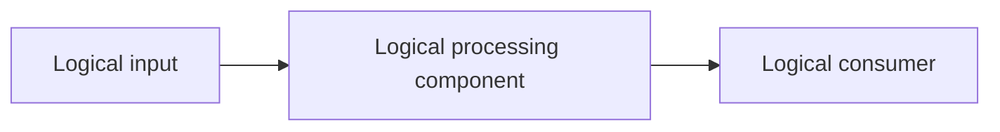

# High-Level Design: <system name>
## 1. Executive summary
<Presales Lite recommendation, business outcome, and logical architecture pattern>

## 2. Confirmed inputs and assumptions
<Separate confirmed inputs from assumptions and unknowns>

## 3. Recommended architecture
<One baseline using logical component names only; explain the pattern and architectural drivers>

## 4. Architecture diagram

## 5. Key decisions and trade-offs
<Key decisions, drivers, and trade-offs>

## 6. Requirements → design rationale
| Requirement | Design mechanism | Status / caveat |
|---|---|---|
| <requirement> | <logical component or mechanism> | Confirmed / Assumption / Unknown |

## 7. Discovery questions and risks
<Highest-impact questions and risks affecting the recommendation>

## 8. Optional alternatives
| Alternative | Prefer it when | Trade-off |
|---|---|---|
| <conditional alternative; include at most two> | <condition> | <trade-off> |
