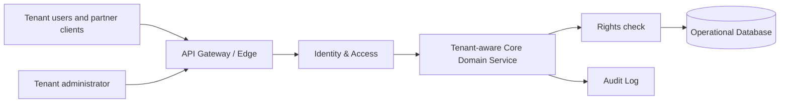
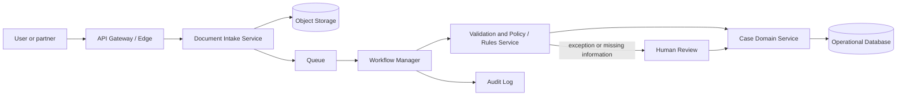
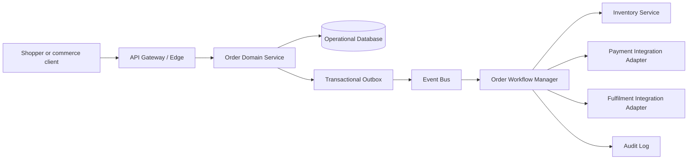
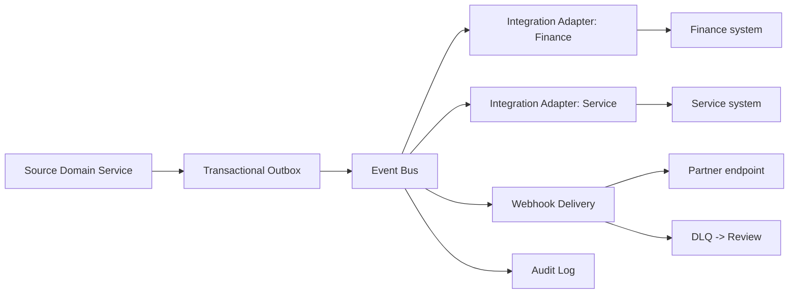
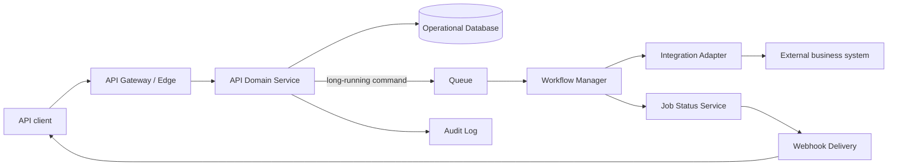
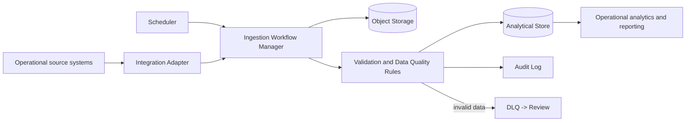
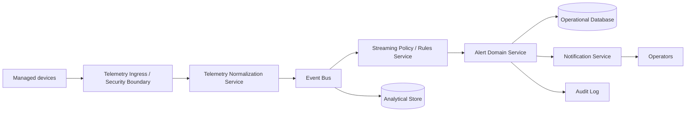

# Enterprise Presales Examples

These examples show how to turn confirmed enterprise needs into vendor-neutral
logical high-level designs. They keep confirmed inputs separate from discovery
assumptions and use conditional alternatives where a different fact would
change the recommendation.

## Example: B2B multi-tenant SaaS

### Scenario and confirmed inputs

A B2B product will let customer organizations manage shared business records
through a web application and partner API. Customer administrators need to
manage their users and configuration, while users must only see records and
actions permitted for their organization.

**Baseline:** the product has no shared tenant platform today; tenant
membership, authorization, and configuration are managed separately.

### Material assumptions

- **Assumption to confirm:** one shared product deployment is acceptable, with
  tenant context enforced in every request and data access path.
- **Unknown:** whether any tenant needs a distinct data residency, retention,
  encryption-key, or operational-isolation boundary.
- Partner API clients can present a stable tenant and caller identity.

### Recommended pattern and why

Use the **API-first multi-tenant SaaS** pattern: establish identity and tenant
context at the edge, keep the domain service authoritative for tenant-scoped
records, and enforce a resource-level rights check before results or actions
are released. It gives web and partner consumers one governed contract while
making tenant isolation an explicit design responsibility.

### Architecture diagram

### Key decisions and trade-offs

- Propagate tenant context through the API, domain, and data layers; this
  supports a shared product but requires systematic cross-tenant leakage tests.
- Keep tenant configuration in the domain boundary instead of giving clients
  direct data access; this protects invariants but makes the API contract a
  product commitment.
- Record administrative and material access actions in an audit log; this aids
  investigation but requires agreement on event retention and access controls.

### Discovery questions and risks

- What isolation level is contractually required for data, administration,
  support access, and operational recovery?
- Where is tenant context established for users, service accounts, and partner
  integrations, and how is conflicting context rejected?
- Which tenant-specific policies, retention rules, or entitlements must be
  evaluated at the resource level rather than only at sign-in?

### Optional alternatives

- If a tenant requires dedicated operational or data isolation, introduce a
  tenant-specific boundary behind the same API contract rather than weakening
  the shared tenant controls.

## Example: Document intake, validation, and human review

### Scenario and confirmed inputs

An operations team receives business documents from users and partner systems.
Each submission must be retained, checked against configurable rules, and
routed either to a downstream case process or to a reviewer when information
is incomplete, inconsistent, or exceptional.

**Baseline:** documents arrive through email and manual handoffs, so validation
evidence and review decisions are difficult to trace consistently.

### Material assumptions

- **Assumption to confirm:** submitting a document may return an acknowledgement
  while validation and review continue asynchronously.
- Document types, required fields, and validation rules are owned by a business
  team and can change independently of the intake application.
- **Unknown:** whether a submitted document may contain sensitive data that
  needs a distinct storage, review, or access boundary.

### Recommended pattern and why

Use the **asynchronous document-processing workflow** pattern: accept a
document once, retain it in object storage, create a tracked work item, and
orchestrate extraction, validation, and human review outside the request path.
This absorbs variable processing time while preserving the original document
and a decision trail.

### Architecture diagram

### Key decisions and trade-offs

- Store immutable source documents separately from case metadata; this enables
  reprocessing and evidence preservation but requires lifecycle controls for
  both stores.
- Separate configurable validation rules from workflow orchestration; business
  changes can be governed independently, though rule versions must accompany
  each decision.
- Route valid exceptions to human review rather than treating them as technical
  failures; this improves decision quality but introduces review ownership and
  backlog-management concerns.

### Discovery questions and risks

- Which document formats, source channels, and correlation identifiers are
  authoritative, and how are duplicates detected?
- What evidence must a reviewer see, and which decisions require a second
  review or escalation?
- Which validation failures are recoverable by the submitter versus requiring
  internal remediation, and how are they communicated?

### Optional alternatives

- If the business needs a final validation result during the submission
  interaction, synchronously validate only the bounded rule set and keep
  document enrichment and human review asynchronous.

## Example: E-commerce order and inventory workflow

### Scenario and confirmed inputs

An e-commerce business needs to accept orders, reserve available inventory,
initiate payment, arrange fulfilment, and inform the customer of outcome. A
customer or client may retry an order submission when a response is lost.

**Baseline:** order, stock, payment, and fulfilment work are coordinated by
manual reconciliation, which can leave mismatched order and inventory state.

### Material assumptions

- **Assumption to confirm:** inventory reservation, payment authorization, and
  fulfilment confirmation remain separate business capabilities.
- A caller can provide an idempotency key that represents one intended order
  submission.
- **Unknown:** which compensation is permitted when an inventory reservation,
  payment step, or fulfilment handoff cannot complete.

### Recommended pattern and why

Use an **order saga with transactional outbox** pattern. The order service
persists its authoritative state and an outbound event together, while a
workflow manager coordinates reservations and compensations through explicit
domain commands. This avoids claiming a distributed transaction exists while
giving every participant a recoverable business state.

### Architecture diagram

### Key decisions and trade-offs

- Treat order creation as idempotent by client-supplied key; this prevents
  duplicate intent from becoming duplicate orders but requires a documented key
  scope and replay response.
- Use a saga with compensating actions rather than a cross-system transaction;
  this supports independent capabilities but makes intermediate order states
  visible and requires business-approved compensation rules.
- Publish from a transactional outbox instead of making a remote call during
  the database update; this improves recoverability but requires monitoring of
  undelivered or repeatedly failing messages.

### Discovery questions and risks

- When is an order considered accepted, and which customer-visible states are
  permitted while downstream steps are pending or compensated?
- What exact reservation, release, authorization, void, and refund actions are
  available from inventory and payment boundaries?
- How long must idempotency records remain available, and how should a request
  with the same key but different content be handled?

### Optional alternatives

- If inventory and payment are proven to be inside one authoritative business
  boundary, start with one transactional order module and defer a distributed
  saga until an external fulfilment boundary requires it.

## Example: Event-driven integration hub

### Scenario and confirmed inputs

Several business applications need to exchange domain changes without each
team building a point-to-point connection. Producers should publish business
facts once, while subscribing systems receive only the events and mappings
they are authorized to consume.

**Baseline:** current integrations are direct and tightly coupled, so one
interface change can require coordinated changes across unrelated systems.

### Material assumptions

- **Assumption to confirm:** the hub distributes immutable domain events rather
  than acting as the system of record for business data.
- Each producer can identify an event owner and versioned event contract.
- **Unknown:** whether some recipients need replayable history, ordered
  processing, or a separate data-sharing approval.

### Recommended pattern and why

Use the **event-driven integration hub** pattern with an event bus for fan-out
and an integration adapter at each external boundary. Producers publish facts
after their own authoritative changes; consumers evolve independently without
direct access to a producer's internal model.

### Architecture diagram

### Key decisions and trade-offs

- Model the hub as a fan-out channel, not a shared integration database; this
  preserves domain ownership but requires consumers to own their local state.
- Isolate mappings and retry behavior in adapters; this limits external-model
  coupling but increases the number of logical integration boundaries to own.
- Retain failed outbound deliveries for review and reprocessing; this improves
  recovery but needs clear ownership for malformed or obsolete events.

### Discovery questions and risks

- Which business facts are stable enough to publish, who owns their schemas,
  and how will compatible evolution be governed?
- Which consumers are allowed to receive each event category, especially where
  event payloads contain sensitive or tenant-scoped information?
- Do recipients require ordering, deduplication, replay, acknowledgement, or
  a reconciliation process after extended unavailability?

### Optional alternatives

- If one recipient needs a request-response business decision instead of a
  notification, place an explicit synchronous integration adapter behind the
  owning domain service rather than forcing that decision through the event bus.

## Example: API platform with synchronous and asynchronous operations

### Scenario and confirmed inputs

An enterprise API platform exposes fast lookup and command operations to
clients, while some commands initiate longer-running work that may require
validation, partner processing, or generated artifacts. Clients need a stable
contract for submission, status, and eventual outcome.

**Baseline:** clients call internal services directly and cannot reliably tell
whether a long-running request was accepted, completed, or must be retried.

### Material assumptions

- **Assumption to confirm:** read operations and bounded commands may complete
  synchronously, while long-running work may return a job reference.
- API consumers can handle an explicit status resource or registered callback
  for asynchronous outcomes.
- **Unknown:** whether each client requires distinct quotas, entitlements, or
  version-support windows.

### Recommended pattern and why

Use an **API-first platform with asynchronous job processing** pattern. The
edge applies identity, contract, and idempotency controls; the domain service
handles immediate work or creates a durable job for a workflow manager. This
keeps request semantics honest without making clients infer state from timeouts.

### Architecture diagram

### Key decisions and trade-offs

- Make synchronous and asynchronous contracts explicit; clients gain predictable
  interaction models, though the platform must document which operation type
  applies to each endpoint.
- Persist job state separately from request transport state; this supports
  recovery and status queries but requires controlled expiry of completed jobs.
- Require idempotency for retryable commands at the API boundary; this protects
  business actions but needs a clear owner for conflict detection and replay.

### Discovery questions and risks

- Which operations require an immediate authoritative response, and which may
  expose an accepted or pending state before completion?
- How do clients authenticate callbacks or poll status, and what happens when
  a callback cannot be delivered?
- Which request fields form the idempotency scope, and which errors are safe
  for a client to retry without changing the intended command?

### Optional alternatives

- If a client cannot support asynchronous outcomes, provide a client-specific
  backend-for-frontend that manages status presentation while preserving the
  platform's asynchronous domain workflow.

## Example: Data ingestion and operational analytics

### Scenario and confirmed inputs

An enterprise needs to collect operational data from business systems, validate
and standardize it, retain lineage, and provide analysis without placing
reporting load on the systems that execute daily operations.

**Baseline:** teams export data manually from operational systems, producing
inconsistent reports and no governed view of source or transformation history.

### Material assumptions

- **Assumption to confirm:** analytical reporting may be based on a refreshed
  derived view rather than the latest operational transaction at every moment.
- Source-system owners can provide authorized extracts, events, or change
  signals and identify their authoritative data fields.
- **Unknown:** whether any reporting use case needs streaming updates rather
  than scheduled batch ingestion.

### Recommended pattern and why

Use a **governed ingestion and analytical-store** pattern: land source data,
validate and transform it through a workflow, retain lineage and quality
outcomes, and publish a read-oriented analytical store. It separates reporting
concerns from operational transactions while making data quality visible.

### Architecture diagram

### Key decisions and trade-offs

- Keep the analytical store separate from operational databases; this protects
  daily operations but requires users to understand the reporting refresh and
  correction process.
- Preserve raw landing data and transformation lineage; this supports audit and
  reproducibility but increases governance and lifecycle responsibilities.
- Begin with scheduled batch ingestion where it fits the use case; it reduces
  operational complexity but may not satisfy genuinely event-driven reporting.

### Discovery questions and risks

- Which reports drive operational decisions, and what data freshness is truly
  required for each rather than assumed globally?
- Who owns source-field definitions, data-quality thresholds, correction
  workflows, and approval for derived business metrics?
- What access controls, retention requirements, and prohibited data uses apply
  once records are combined for analysis?

### Optional alternatives

- If a confirmed use case needs continuously updated derived data, add a
  streaming ingestion path for that source while retaining the same validation,
  lineage, and analytical boundaries.

## Example: Real-time telemetry platform

### Scenario and confirmed inputs

Connected products and operational equipment emit telemetry that operators need
to observe, correlate with asset context, and turn into actionable alerts. The
platform must accept data from managed devices and make an auditable distinction
between a raw signal, a derived alert, and a human acknowledgement.

**Baseline:** telemetry is inspected in device-specific tools, so operators
cannot consistently correlate conditions, ownership, or acknowledgement state.

### Material assumptions

- **Assumption to confirm:** telemetry may be processed as a stream and alerts
  may be delivered after rule evaluation rather than during device transmission.
- Each device can establish an authenticated identity and is associated with an
  authorized asset or tenant context.
- **Unknown:** which telemetry categories require raw retention, aggregation,
  deletion, or access restriction for safety and regulatory purposes.

### Recommended pattern and why

Use a **real-time telemetry and event-processing** pattern: authenticate device
ingress, publish normalized events to an event bus, process them through
streaming rules, and keep alerts and acknowledgements in an operational domain
service. This supports fan-out to operators and analytics while separating raw
signals from business decisions.

### Architecture diagram

### Key decisions and trade-offs

- Establish a device security boundary before telemetry joins internal flows;
  this reduces spoofing and tenant-mixing risk but requires lifecycle ownership
  for device credentials and revocation.
- Use the event bus for independent fan-out to alerting and analytics; this
  keeps consumers decoupled but requires deduplication and schema governance.
- Keep alert acknowledgement as domain state rather than overwriting raw
  telemetry; this supports accountability but requires clear rules for alert
  correlation and closure.

### Discovery questions and risks

- Which device identities, onboarding process, and credential-rotation rules
  are required before telemetry can be accepted?
- Which conditions create an alert, who can acknowledge or suppress it, and
  what evidence must be retained for investigation?
- How should duplicate, delayed, out-of-order, or malformed telemetry affect
  asset state, operator alerts, and analytical records?

### Optional alternatives

- If network constraints prevent continuous event delivery from some devices,
  add a store-and-forward edge gateway that preserves the same authentication,
  ordering, and audit responsibilities before forwarding telemetry.
