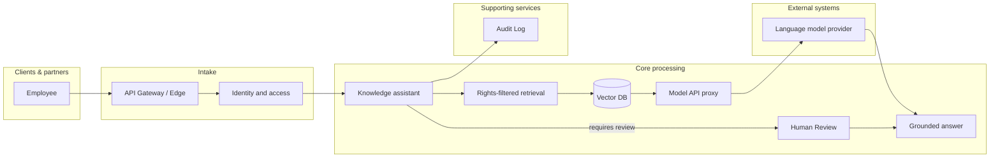
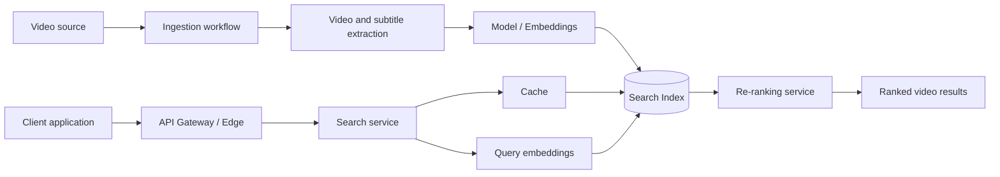
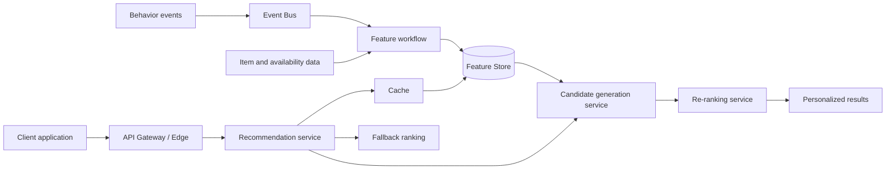
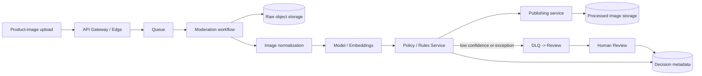
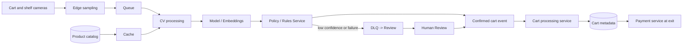
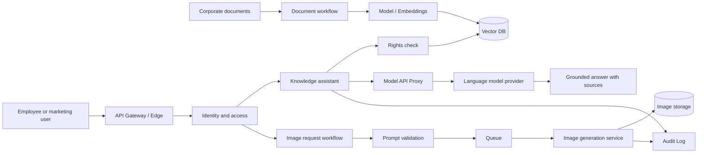

# ML/AI Presales Examples

These examples illustrate how to turn confirmed business inputs into a
vendor-neutral high-level design. They distinguish source-backed inputs from
assumptions that need confirmation during discovery.

## Visual composition example

- The primary answer path runs left-to-right from the employee request through
  retrieval and the model provider to the grounded answer.
- `Human Review` sits below the primary path as the exception route for a
  response that needs approval before release.
- `Audit Log` is a supporting service below the main flow, rather than a stop
  on the answer path.
- The only edge label marks the review decision; the other arrows use concise
  node names to keep the diagram readable.
- Document indexing, access-metadata refresh, and delivery-retry edges remain
  in the data-flow prose so the diagram keeps one architectural story.

## Example: Video search

### Scenario and confirmed inputs

A media platform wants people to find videos by what is spoken or shown, not
only by title and metadata. The source material calls for an integration API,
English-language queries, recurring processing of new videos, and a search
response budget below 500 ms.

**Baseline:** video metadata alone does not provide content-aware discovery;
new video material is prepared on a scheduled cadence.

### Material assumptions

- Video owners can supply subtitles when available, and frame sampling is
  permitted for indexing.
- Each video has stable identity and metadata so a derived index can be rebuilt.
- Search results can be temporarily stale while the indexing path catches up.

### Recommended pattern and why

Use the **Search** pattern with separate indexing and serving paths. The
indexing path turns subtitles and sampled frames into searchable representations;
the serving path retrieves candidates and re-ranks them without doing video
processing during a query.

### Architecture diagram

### Key decisions and trade-offs

- Use a derived search index rather than querying raw video at request time;
  this protects query latency but introduces indexing freshness as an operating
  concern.
- Combine subtitle and visual representations where they improve relevance;
  this broadens recall but increases indexing cost and evaluation work.
- Keep re-ranking on the retrieved candidate set; it can improve result order
  while bounding the work on the synchronous path.

### Discovery questions and risks

- Which languages, content rights, and metadata filters must the first release
  support?
- What indexing delay is acceptable for new or corrected videos?
- How will relevance be measured, and what response is acceptable when the
  index or re-ranker is unavailable?

### Optional alternatives

- Start with subtitle and metadata retrieval only, then add visual retrieval
  after measuring the relevance gap.
- Use hybrid keyword and semantic retrieval when exact-title matches matter as
  much as concept matches.

## Example: Personalized recommender

### Scenario and confirmed inputs

A platform wants to replace coarse, identical results with recommendations
that reflect a person's history, stated preferences, current behavior, and
context. The source materials describe both media and accommodation variants;
the accommodation variant also uses listing availability and price. They call
for an integration API, interaction-driven updates, and a recommendation
response budget below 300 ms.

**Baseline:** users currently rely on filters or a generic catalog ordering,
so the platform does not systematically personalize ranking.

### Material assumptions

- Consent and policy permit the selected user, session, and item signals to be
  used for personalization.
- The business can define a safe non-personalized fallback for new users,
  missing features, or degraded model service.
- Item availability and price changes have an authoritative source that can
  refresh serving features.

### Recommended pattern and why

Use the **Recommender** pattern: prepare user and item features outside the
request path, generate a manageable candidate set, and re-rank it with the
current request context. This keeps online work bounded while preserving a
clear route for fresh feedback and catalog changes.

### Architecture diagram

### Key decisions and trade-offs

- Separate feature preparation from online serving; this supports responsive
  requests but means personalization freshness must be explicitly owned.
- Use candidate generation before re-ranking; it narrows expensive scoring but
  can exclude items unless retrieval quality is monitored.
- Include a non-personalized fallback; it reduces personalization coverage in
  a degraded state but gives the client a predictable result.

### Discovery questions and risks

- Which user signals are allowed, and how is consent withdrawal handled?
- What does “real time” mean for behavior updates: immediate event use, short
  cache invalidation, or a scheduled refresh?
- Which business constraints must apply before ranking, such as availability,
  eligibility, diversity, or sponsored placement?

### Optional alternatives

- Begin with scheduled feature refresh and add streaming updates where observed
  value justifies the additional complexity.
- Use rules-based ranking for the initial fallback while collecting feedback for
  a learned ranker.

## Example: Product image content moderation

### Scenario and confirmed inputs

A platform needs to resize uploaded product images, screen them for
unacceptable content, and either publish them or route them to audit. The
source material identifies categories such as nudity, violence, and prohibited
symbols.

**Baseline:** unchecked uploads could be published, exposing users and the
platform to policy and safety risk.

### Material assumptions

- **Assumption to confirm:** an automated publish-or-review decision is needed
  within ten seconds of upload.
- Policy owners define the prohibited-content taxonomy and decision thresholds.
- A staffed review process can adjudicate uncertain, contested, or failed
  automated decisions.
- Stored images and decision evidence follow the platform's retention and
  access rules.

### Recommended pattern and why

Use the **Content moderation** pattern with an asynchronous work queue,
policy separated from model scoring, and an explicit human-review branch. It
absorbs upload bursts without silently publishing uncertain content.

### Architecture diagram

### Key decisions and trade-offs

- Run moderation before publication; it reduces exposure risk but can delay
  the availability of a valid image.
- Keep policy thresholds separate from the model; policy changes can then be
  governed without retraining the model, but the integration needs auditable
  versioning.
- Send uncertain cases to human review rather than automatically rejecting or
  approving them; this improves safety controls but requires review capacity.

### Discovery questions and risks

- Which harms can be blocked automatically, and which always require a human
  decision?
- Is the target of ten seconds for the automated decision measured before or after image
  transformation, and what is the expected upload volume profile?
- What appeal, audit, and notification experience is required for rejected
  images?

### Optional alternatives

- Use synchronous screening only for small uploads when the product requires
  an immediate upload result.
- Add separate modality-specific checks if product imagery must also be matched
  against catalog or trademark rules.

## Example: Smart-cart real-time CV

### Scenario and confirmed inputs

A cashier-less store wants to recognize products added to or removed from a
cart using store and cart camera images, maintain cart contents by cart number,
and charge at exit without a checkout scan. The source material calls for human
review of low-confidence detections.

**Baseline:** conventional checkout queues create friction, while unverified
automated cart updates could create billing errors.

### Material assumptions

- **Assumption to confirm:** the cart state must update within three seconds of
  a product action.
- Cart identifiers can be reliably associated with the relevant camera events.
- The product catalog contains enough visual and product metadata to resolve a
  detected item.
- Store connectivity, camera placement, and image-retention rules are agreed
  before rollout.

### Recommended pattern and why

Use the **Real-time CV** pattern with edge sampling, an event queue, confidence
and policy evaluation, and a cart-state service. It minimizes the amount of
camera data on the synchronous path while keeping uncertain events out of the
billing record until resolved.

### Architecture diagram

### Key decisions and trade-offs

- Use edge sampling before central processing; it can reduce network load and
  response time, but adds hardware and deployment management at each store.
- Treat model confidence and business policy as separate decisions; this makes
  billing controls clearer but requires calibration and policy ownership.
- Update cart state only from confirmed events; this favors billing integrity
  over immediately applying uncertain detections.

### Discovery questions and risks

- Does the target of three seconds for a cart update apply to all detections, and what
  quality and resolution time are acceptable before a shopper reaches the exit?
- How are overlapping shoppers, occlusions, returns, and product substitutions
  handled?
- What are the privacy, retention, and incident-investigation requirements for
  camera frames and review evidence?

### Optional alternatives

- Perform more inference at the edge where connectivity or privacy constraints
  make central processing unsuitable.
- Use central inference first for a limited pilot when faster model updates are
  more important than minimizing network dependency.

## Example: Knowledge assistant with RAG + image generation

### Scenario and confirmed inputs

Employees need English-language answers and project examples grounded in
corporate documents, while marketing users need to create images from text
with style and format controls. The source material requires per-user document
access enforcement and availability of newly added documents within a day.

**Baseline:** employees search corporate material manually, and marketing
users create imagery in a manual editor; neither path provides a governed,
shared AI experience.

### Material assumptions

- **Assumption to confirm:** the knowledge-assistant experience must support at
  least five simultaneous chatbot users without quality loss.
- Document identities, access rules, and authoritative sources are available
  to the indexing and retrieval paths.
- Data-handling policy permits the selected model-provider boundary, or an
  approved controlled deployment is available.
- Image-generation requests can complete asynchronously, with clear status and
  retrieval of the finished asset.

### Recommended pattern and why

Combine the **RAG / GenAI chatbot** pattern with an asynchronous image
generation workflow behind a shared identity-aware entry point. Retrieval is
rights-filtered before grounded context reaches the language model, while a
queue prevents long-running image generation from blocking conversational
requests.

### Architecture diagram

### Key decisions and trade-offs

- Enforce rights before retrieved context is sent to a model; this reduces
  exposure risk but depends on accurate, timely access metadata.
- Keep document indexing separate from answer serving; this permits refresh and
  recovery of the vector index but means new content may not be immediate.
- Run image generation asynchronously; this protects interactive chat capacity
  but requires a job-status and delivery experience.

### Discovery questions and risks

- Which document sources are authoritative, which access rules apply, and what
  evidence must accompany an answer?
- Which prompts, documents, and generated images may cross the model-provider
  boundary, and what logging or retention rules govern them?
- Does the five simultaneous chatbot users target apply across chat and image work,
  and what user experience is acceptable for delayed image completion?

### Optional alternatives

- Start with retrieval and citations only, then add an answer-generation model
  after content quality and rights controls are proven.
- Use tenant- or department-scoped knowledge bases where access isolation is
  stronger than shared retrieval filtering.
