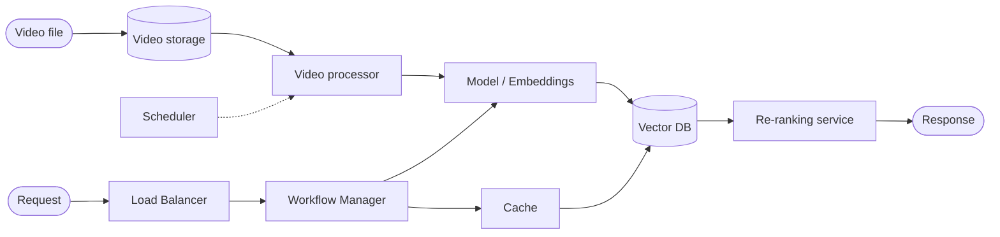
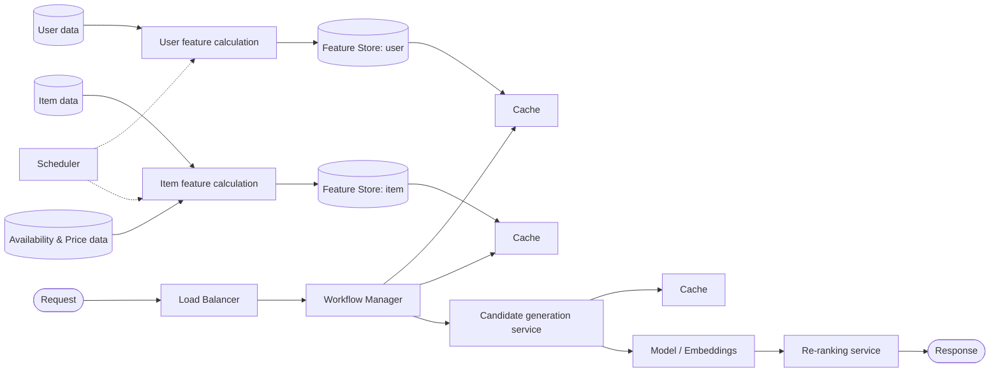
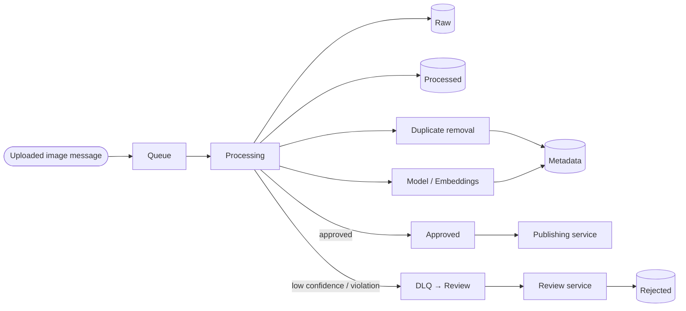
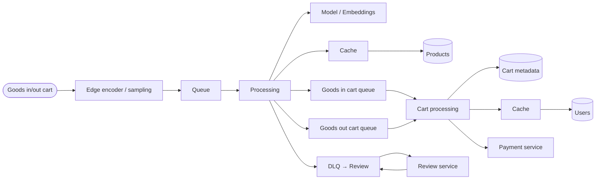
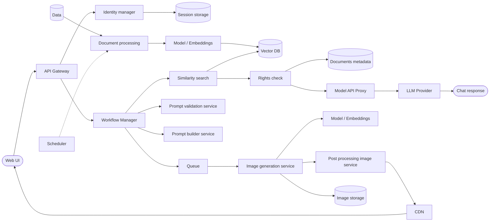

# Worked Examples (Few-Shot)

Five complete `requirements → HLD` pairs, each traced from a reference
architecture diagram. Use these as few-shot exemplars: match their structure,
canonical block names, and the level of detail in the Mermaid diagrams and
tables.

---

## Example 1: Video Search

### Requirements

# Requirements: Video Search

## Problem
- **Business problem:** Users cannot find videos by what is actually shown or said in them, only by metadata; search relevance and coverage are poor.
- **ML problem:** Build a search system that indexes video not only by metadata but also by content — subtitle text and imagery extracted from frames.

## Functional Requirements (FR)
- FR1: Provide an API for integration with client applications.
- FR2: Let users find videos using English-language search queries.
- FR3: Automatically process new videos and add them to the search index once per hour.

## Non-Functional Requirements (NFR)
| NFR | Target | Notes |
|-----|--------|-------|
| Latency (p95) | < 500 ms | search request to ranked response |
| Throughput | 500 QPS | |
| Data freshness | new videos indexed within 1 h | driven by `Scheduler` |
| Availability | not specified | assume 99.9% default |
| Access control | not specified | N/A for this example |
| Cost / budget | — | |
| Privacy / compliance | — | |

## Out of scope
- Non-English queries.
- Video moderation / content-safety filtering (see Example 3).

### High-Level Design

# High-Level Design: Video Search

## 1. Summary
A video search engine that mirrors the Indexing ↔ Serving master pattern: an
offline pipeline extracts embeddings from uploaded video (subtitles + frames)
into a shared vector index once an hour, while an online pipeline embeds the
incoming query, retrieves nearest neighbors, re-ranks, and returns results
within the 500 ms budget.

## 2. Architecture diagram

## 3. Components
| Component | Role | Which NFR it serves |
|-----------|------|---------------------|
| Video storage | Holds raw uploaded video files pending processing | — |
| Video processor | Extracts subtitle text and sampled frames from each video | Data freshness |
| Scheduler | Triggers the video processor once per hour | Data freshness (hourly indexing) |
| Model / Embeddings | Computes embeddings for extracted video content and for incoming query text | FR2 relevance |
| Vector DB | Stores video embeddings ("Video Index") and serves nearest-neighbor search | Latency, FR2 |
| Load Balancer | Distributes incoming search requests across serving replicas | Throughput (500 QPS) |
| Workflow Manager | Orchestrates a query: embed → check cache → search → re-rank → respond | Latency (p95) |
| Cache | Serves repeated/recent queries without recomputation | Latency (p95) |
| Re-ranking service | Improves ranking quality on the candidate set before returning results | FR2 relevance |

## 4. Data flow
1. **Ingestion:** Video file → Video storage → Video processor (extract subtitles/frames) → Model / Embeddings → Vector DB. Scheduler fires this path hourly.
2. **Serving:** Request → Load Balancer → Workflow Manager → Model / Embeddings (embed query) → Cache (check first) → Vector DB (on miss) → Re-ranking service → Response.

## 5. NFR → design rationale
| NFR | Target | How the design meets it |
|-----|--------|--------------------------|
| Latency (p95) | < 500 ms | Cache absorbs repeated queries; Vector DB gives sub-linear nearest-neighbor lookup; re-ranking runs only on a small candidate set |
| Throughput | 500 QPS | Load Balancer fans requests across stateless Workflow Manager replicas |
| Data freshness | hourly indexing | Scheduler drives the Video processor on a fixed 1 h interval, decoupled from the serving path |

## 6. Open questions / risks
- Should indexing be event-driven (on upload) in addition to hourly, to reduce worst-case staleness for popular new uploads?
- What is the acceptable availability target — assumed 99.9% pending client confirmation.

---

## Example 2: Recommender (video / housing listings)

### Requirements

# Requirements: Recommender (video / housing listings)

## Problem
- **Business problem:** The platform (7M+ housing listings across 220+ countries, 150M monthly active users, growing to 200M/year — or, in the video variant, a video platform) only lets users filter by coarse criteria (price, location, type), ignoring individual preference; this depresses booking/engagement conversion. The client wants a personalized system that lifts booking conversion by 25%.
- **ML problem:** Build a personalized recommendation system that ranks items (housing listings, or videos) per user, combining booking/watch history, stated preferences, on-site behavior, and search context (dates, guest count, trip purpose for housing).

## Functional Requirements (FR)
- FR1: Provide an API for integration with the web application.
- FR2: Recommendations update in real time as the user interacts with the platform.
- FR3: Rank items using both user features (history, preferences, behavior) and item features (listing/video attributes, availability and price for housing).
- FR4: Automatically fold new items into recommendations within an hour of becoming available.

## Non-Functional Requirements (NFR)
| NFR | Target | Notes |
|-----|--------|-------|
| Latency (p95) | < 300 ms | per recommendation request |
| Throughput | 10,000 QPS | sized for 150M MAU, growing to 200M/year |
| Data freshness | item features refreshed within 1 h | user features updated via Scheduler batch + real-time interaction signals |
| Availability | not specified | assume 99.9% default |
| Access control | not specified | N/A for this example |
| Cost / budget | must scale to 200M MAU/year | |
| Privacy / compliance | — | |

## Out of scope
- Cold-start handling for brand-new users with no history.
- Cross-region data residency requirements.

### High-Level Design

# High-Level Design: Recommender (video / housing listings)

## 1. Summary
A two-sided recommender following the Feature-Store-driven Recommender
pattern: user and item features are computed offline on a schedule into
per-entity Feature Stores fronted by Cache, and a request-time path fans out
to candidate generation followed by re-ranking to produce a personalized,
sub-300 ms response.

## 2. Architecture diagram

## 3. Components
| Component | Role | Which NFR it serves |
|-----------|------|---------------------|
| User feature calculation | Turns raw user data into user features | Data freshness |
| Item feature calculation | Turns raw item data (listing + availability/price, or video metadata) into item features | Data freshness |
| Feature Store: user | Serves consistent user features online and offline | FR3 |
| Feature Store: item | Serves consistent item features online and offline | FR3 |
| Scheduler | Triggers user/item feature recalculation on a fixed interval | Data freshness (hourly) |
| Cache | Fronts each Feature Store and the candidate-generation results to avoid recomputation | Latency (p95) |
| Load Balancer | Distributes incoming recommendation requests | Throughput (10,000 QPS) |
| Workflow Manager | Orchestrates a request: fetch features → generate candidates → re-rank → respond | Latency (p95) |
| Candidate generation service | Retrieves a manageable candidate set per user from features | FR3 |
| Model / Embeddings | Candidate generation / scoring model invoked by the candidate generation service | FR3 |
| Re-ranking service | Produces the final personalized ordering from the candidate set | FR3, FR2 |

## 4. Data flow
1. **Ingestion:** User data → User feature calculation → Feature Store: user. Item data + Availability & Price data → Item feature calculation → Feature Store: item. Scheduler drives both paths hourly.
2. **Serving:** Request → Load Balancer → Workflow Manager → Cache (user, item features) → Candidate generation service (+ Model / Embeddings, with its own results Cache) → Re-ranking service → Response.

## 5. NFR → design rationale
| NFR | Target | How the design meets it |
|-----|--------|--------------------------|
| Latency (p95) | < 300 ms | Feature Stores are fronted by Cache; candidate generation narrows the ranking problem before the (more expensive) re-ranking step runs |
| Throughput | 10,000 QPS | Load Balancer spreads load across stateless Workflow Manager instances; feature reads are cache-served, not recomputed per request |
| Data freshness | hourly item refresh | Scheduler retriggers feature calculation jobs on a 1 h cadence, independent of the request path |

## 6. Open questions / risks
- Confirm whether "real-time" recommendation updates (FR2) require streaming user-feature updates, or whether cache invalidation on interaction events suffices.
- Confirm target availability and whether video and housing deployments should share one feature pipeline or run separate ones.

---

## Example 3: Image content moderation

### Requirements

# Requirements: Image content moderation

## Problem
- **Business problem:** Uploaded images may contain content unacceptable for the platform, risking user harm and policy violations if published without review.
- **ML problem:** Build a system that automatically checks uploaded images for unacceptable content.

## Functional Requirements (FR)
- FR1: Automatically resize uploaded images to the platform's standard formats.
- FR2: Check every uploaded image for unacceptable content (nudity, violence, banned symbols).
- FR3: Route every image to either "approved / published" or "rejected / sent for audit" within the latency budget.

## Non-Functional Requirements (NFR)
| NFR | Target | Notes |
|-----|--------|-------|
| Latency (p95) | ≤ 10 s | from upload to publish-or-review decision |
| Throughput | ≥ 2,000 images/minute | |
| Data freshness | N/A | real-time processing pipeline, not an index |
| Availability | not specified | assume 99.9% default |
| Access control | not specified | N/A for this example |
| Cost / budget | — | |
| Privacy / compliance | must not publish policy-violating content | |

## Out of scope
- Video moderation (frame-by-frame); this example covers still images only.
- Appeals workflow for rejected content.

### High-Level Design

# High-Level Design: Image content moderation

## 1. Summary
An event-driven moderation pipeline: uploaded images flow through a Queue
into a Processing step that resizes, deduplicates, and scores each image with
a moderation model, then branches into an approved/publish path or a
low-confidence/violating path routed to `DLQ → Review` for a human reviewer.

## 2. Architecture diagram

## 3. Components
| Component | Role | Which NFR it serves |
|-----------|------|---------------------|
| Queue | Buffers uploaded-image events so bursts of uploads don't block callers | Throughput (2,000 img/min) |
| Processing | Orchestrates resize, dedup, scoring, and the approve/review branch for one image | Latency (≤ 10 s) |
| Duplicate removal | Detects images already seen before, avoiding redundant moderation | Throughput |
| Model / Embeddings | Scores the image for unacceptable content (nudity, violence, banned symbols) | FR2 |
| Raw / Processed / Rejected | Storage for the image at each pipeline stage | — |
| Metadata | Stores per-image processing and scoring metadata | — |
| DLQ → Review | Captures low-confidence or violating images for a human reviewer instead of silently publishing or dropping them | Privacy / compliance |
| Publishing service | Publishes approved images to the platform | FR3 |
| Review service | Human review UI/queue consumer for flagged images | Privacy / compliance |

## 4. Data flow
1. **Ingestion / processing:** Uploaded image message → Queue → Processing (resize → Duplicate removal + Model / Embeddings scoring, both write Metadata).
2. **Branching:** Processing → Approved → Publishing service (published), or Processing → DLQ → Review → Review service → Rejected storage.

## 5. NFR → design rationale
| NFR | Target | How the design meets it |
|-----|--------|--------------------------|
| Latency (p95) | ≤ 10 s | Queue decouples ingestion bursts from processing; a single Processing step performs resize + dedup + scoring in one pass |
| Throughput | ≥ 2,000 img/min | Queue absorbs load spikes; Processing workers scale horizontally behind the queue |
| Privacy / compliance | no violating content published | Low-confidence and violating images are never auto-published — they are always routed to `DLQ → Review` for a human decision |

## 6. Open questions / risks
- What confidence threshold separates "approved" from "needs review"?
- Confirm SLA for the Review service — the 10 s target only covers the automated decision, not human review time.

---

## Example 4: Smart-cart real-time CV

### Requirements

# Requirements: Smart-cart real-time CV

## Problem
- **Business problem:** Traditional checkouts create long queues and hurt the customer experience. The client wants a cashier-less store where shoppers take products off shelves and pay at exit by cart number, without scanning items at checkout.
- **ML problem:** Build a system that automatically recognizes which products are placed into (or removed from) a cart, based on in-store and in-cart camera images.

## Functional Requirements (FR)
- FR1: Detect products added to or removed from a cart from camera frames in real time.
- FR2: Maintain per-cart contents (cart metadata) associated with a cart number.
- FR3: Trigger payment at exit using the final cart contents, without a checkout scan.
- FR4: Escalate low-confidence product detections to a human reviewer instead of silently mis-attributing items.

## Non-Functional Requirements (NFR)
| NFR | Target | Notes |
|-----|--------|-------|
| Latency (p95) | ≤ 3 s | from product entering/leaving cart to system update |
| Throughput | sized to concurrent in-store cameras/carts | no explicit QPS given |
| Data freshness | real-time (frame-level) | |
| Availability | not specified | assume 99.9% default — in-store system must stay up during business hours |
| Access control | not specified | N/A for this example |
| Cost / budget | — | |
| Privacy / compliance | in-store camera footage of shoppers | |

## Out of scope
- Facial recognition / shopper identity from video (cart is identified by cart number only).
- Self-checkout kiosks as a fallback path.

### High-Level Design

# High-Level Design: Smart-cart real-time CV

## 1. Summary
An edge-to-cloud real-time computer-vision pipeline matching the Real-time CV
pattern: cart/shelf cameras sample frames at the edge, a model classifies
goods-in / goods-out events per cart within a 3 s budget, and low-confidence
detections are escalated to human review rather than silently applied to the
cart, which finally drives payment at exit.

## 2. Architecture diagram

## 3. Components
| Component | Role | Which NFR it serves |
|-----------|------|---------------------|
| Edge encoder / sampling | Samples and encodes camera frames at the edge before upload | Latency (≤ 3 s) |
| Queue | Buffers frame/detection events between edge and processing | Latency, throughput |
| Processing | Runs product detection per frame and classifies goods-in/out events | Latency (≤ 3 s) |
| Model / Embeddings | Classifies which product is being added/removed from a frame | FR1 |
| Cache | Fronts the Products catalog lookup used during classification | Latency |
| Goods in cart queue / Goods out cart queue | Per-event-type queues feeding cart-state updates | FR1, FR2 |
| DLQ → Review | Captures low-confidence detections for a human reviewer instead of silently updating the cart | Privacy / compliance, FR4 |
| Review service | Human reviewer consumes DLQ items and corrects/confirms detections | FR4 |
| Cart processing | Applies confirmed goods-in/out events to the cart's running state | FR2 |
| Cache (users) | Fronts the Users lookup used by Cart processing | Latency |
| Payment service | Charges the shopper's account for the final cart contents at exit | FR3 |

## 4. Data flow
1. **Real-time detection:** Goods in/out cart event → Edge encoder / sampling → Queue → Processing (Model / Embeddings scores the frame against Products via Cache).
2. **Branching:** Processing → Goods in / Goods out cart queue → Cart processing (updates Cart metadata, looks up Users via Cache) → Payment service at exit. Low-confidence detections instead go to `DLQ → Review` → Review service, which can resolve back into the pipeline.

## 5. NFR → design rationale
| NFR | Target | How the design meets it |
|-----|--------|--------------------------|
| Latency (p95) | ≤ 3 s | Edge sampling reduces payload before the network hop; Queue plus a dedicated Processing tier keep the detect-to-update path short |
| Data freshness | real-time | Frame-level events flow continuously through the Queue rather than being batched |
| Privacy / compliance | uncertain detections not silently applied | `DLQ → Review` intercepts low-confidence classifications before they affect billing |

## 6. Open questions / risks
- What happens to a cart if Review service resolution takes longer than the shopper's time in-store?
- Confirm expected concurrent carts/cameras per store to size Queue and Processing throughput.

---

## Example 5: GenAI RAG chatbot + text-to-image

### Requirements

# Requirements: GenAI RAG chatbot + text-to-image

## Problem
- **Business problem:** (a) Employees need fast, relevant answers and project examples drawn from corporate documents instead of manually searching them. (b) Marketing users spend a lot of time manually creating images (banners, posts, presentations) in a manual editor; competitors already offer automated content generation, risking customer and revenue loss.
- **ML problem:** Build (a) a chatbot with retrieval-augmented search over corporate document content that returns relevant answers and project examples, and (b) an image-generation system that produces images from a user's text prompt with style/format control.

## Functional Requirements (FR)
- FR1: Provide chatbot answers in English, grounded in corporate documents.
- FR2: Surface relevant project examples in answers, drawn from document content.
- FR3: Generate images from a user's text prompt, with control over style and format.
- FR4: Enforce each user's document access level on any document content used in an answer.

## Non-Functional Requirements (NFR)
| NFR | Target | Notes |
|-----|--------|-------|
| Latency (p95) | not specified | no explicit target given in source |
| Throughput | ≥ 5 concurrent users | without quality degradation (chatbot) |
| Data freshness | new documents available within 24 h | |
| Availability | not specified | assume 99.9% default |
| Access control | per-user document access level enforced on retrieved content | |
| Cost / budget | external LLM/image-model calls | mediate via `Model API Proxy` |
| Privacy / compliance | corporate document content must not leak across access levels | |

## Out of scope
- Non-English chatbot answers.
- Video generation (image generation only).

### High-Level Design

# High-Level Design: GenAI RAG chatbot + text-to-image

## 1. Summary
A GenAI platform combining two request paths behind a shared entry point: a
RAG chatbot path that embeds documents offline into a `Vector DB`, retrieves
and rights-checks them online, then proxies to an LLM; and a text-to-image
path that validates/builds a prompt, queues an async image-generation job, and
returns the result via CDN. Both paths share Web UI, API Gateway, identity,
and Workflow Manager.

## 2. Architecture diagram

## 3. Components
| Component | Role | Which NFR it serves |
|-----------|------|---------------------|
| API Gateway | Single entry point for the Web UI; routes to auth and to Workflow Manager | Availability |
| Identity manager | Authenticates the user and manages sessions | Access control |
| Scheduler | Triggers document (re)processing on a periodic basis | Data freshness (24 h) |
| Document processing | Extracts/chunks corporate document content for embedding | Data freshness |
| Model / Embeddings | Embeds document chunks (ingestion) and, separately, generates images (image path) | FR1, FR3 |
| Vector DB | Stores document embeddings and serves similarity search | FR1, FR2 |
| Workflow Manager | Orchestrates a request across both the chatbot and image-generation paths | Throughput (5 concurrent users) |
| Similarity search | Retrieves candidate document chunks for a query | FR1, FR2 |
| Rights check | Filters retrieved documents to those the requesting user is allowed to see | Access control (FR4) |
| Model API Proxy | Mediates calls to the external LLM provider behind one internal interface | Cost / vendor abstraction |
| Prompt validation service | Validates the user's image-generation prompt before it is queued | FR3 |
| Prompt builder service | Builds the final generation prompt from user input and style/format controls | FR3 |
| Queue | Decouples the request path from the (slower) async image-generation job | Throughput |
| Image generation service | Runs the text-to-image generation job | FR3 |
| Post processing image service | Post-processes the generated image (format/style finishing) | FR3 |
| CDN | Serves the finished image back to the Web UI | Latency |

## 4. Data flow
1. **Document ingestion (offline):** Scheduler → Document processing (reads Data) → Model / Embeddings → Vector DB. Refreshed at least every 24 h.
2. **Chatbot serving:** Web UI → API Gateway → Identity manager (auth) → Workflow Manager → Similarity search → Vector DB → Rights check (filter by user access) → Model API Proxy → LLM Provider → Chat response.
3. **Image generation serving:** Web UI → API Gateway → Workflow Manager → Prompt validation service + Prompt builder service → Queue → Image generation service (+ Model / Embeddings) → Post processing image service → Image storage → CDN → back to Web UI.

## 5. NFR → design rationale
| NFR | Target | How the design meets it |
|-----|--------|--------------------------|
| Throughput | ≥ 5 concurrent users | Workflow Manager and downstream services are stateless and horizontally scalable behind the API Gateway |
| Data freshness | new documents within 24 h | Scheduler re-triggers Document processing on a fixed cadence, independent of request traffic |
| Access control | per-user document access level | Rights check runs between Similarity search and the Model API Proxy, so no out-of-access content ever reaches the LLM or the response |
| Cost / budget | external LLM/image-model calls | Model API Proxy centralizes external calls behind one interface for quota/cost control; Queue makes image generation async so it doesn't hold serving capacity |

## 6. Open questions / risks
- No explicit chatbot latency target was given — confirm an acceptable p95 with the client.
- Confirm whether image generation is expected synchronously (user waits) or asynchronously (notified when ready) given it runs behind a Queue.
- Confirm whether Rights check failures should return a partial answer or a hard denial.
