# Data and Reliability Patterns

Use these vendor-neutral pattern cards to select logical building blocks for
data movement, durable operational behavior, and recovery. Treat the Operational Database as the authoritative boundary for transactional work and the Analytical Store as the separate boundary for historical analysis; do not use an analytical projection to make operational decisions, and make repeated asynchronous work idempotent.

## File ingestion
**Use when:** Users, partners, or internal processes submit files that must be validated, retained, and processed outside the request path.
**Avoid when:** The input is a small synchronous command with no file lifecycle, retention, or asynchronous processing need.
**Minimal logical blocks:** API Gateway / Edge, Object Storage, Operational Database, Queue, and Workflow Manager.
**Variants:** Direct upload to Object Storage; partner drop through Integration Adapter; Human Review for invalid or sensitive files.
**Trade-offs:** Separating file receipt from processing absorbs bursts and preserves durable source material, but introduces asynchronous status and lifecycle management.
**Failure / operational notes:** Record file identity and processing status in the Operational Database, validate before downstream use, and route unrecoverable work to DLQ → Review without exposing storage implementation details.
**Discovery questions:** Who submits files, what proves a file was accepted, how long must source files remain available, and which failures need human correction?
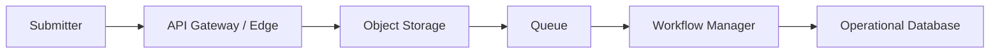

## Document processing
**Use when:** Documents need extraction, classification, enrichment, or review before their content can support a business process.
**Avoid when:** The document is only stored for retrieval and no interpretation, decision, or workflow is required.
**Minimal logical blocks:** Object Storage, Workflow Manager, Core Domain Service, Operational Database, and Human Review.
**Variants:** Model / Embeddings for extraction; Search Index for document discovery; Policy / Rules Service for routing decisions.
**Trade-offs:** A managed processing flow makes document state and exceptions visible, but document-derived results may be delayed or require human validation.
**Failure / operational notes:** Preserve the source document separately from derived results, keep review decisions attributable, and make each processing step safe to repeat at the business outcome level.
**Discovery questions:** Which document facts are authoritative, what confidence or policy threshold needs review, and how are corrected results fed back into the process?
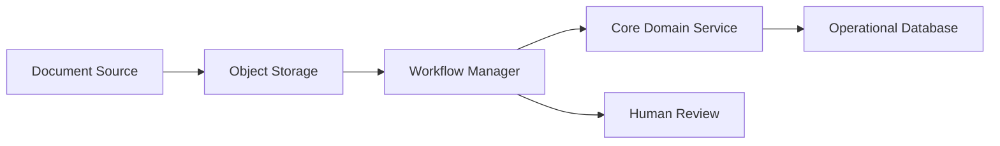

## Batch ETL
**Use when:** Periodic, governed transformation is needed to prepare operational data for reporting, analysis, or model development.
**Avoid when:** Consumers need a current operational decision or transaction outcome; keep that work in the Operational Database.
**Minimal logical blocks:** Scheduler, Workflow Manager, Operational Database, Analytical Store, and Audit Log.
**Variants:** Source files from Object Storage; multiple governed source domains; analytical outputs for model training or business reporting.
**Trade-offs:** Scheduled processing provides repeatable, governed analytical refreshes, but data becomes available on a cadence rather than immediately.
**Failure / operational notes:** Keep operational writes and analytical transformations as separate responsibilities, record run outcomes in Audit Log, and reconcile incomplete loads before declaring an analytical refresh usable.
**Discovery questions:** What freshness is acceptable, which transformations require governance, who owns the analytical definitions, and how is a failed run detected and reconciled?
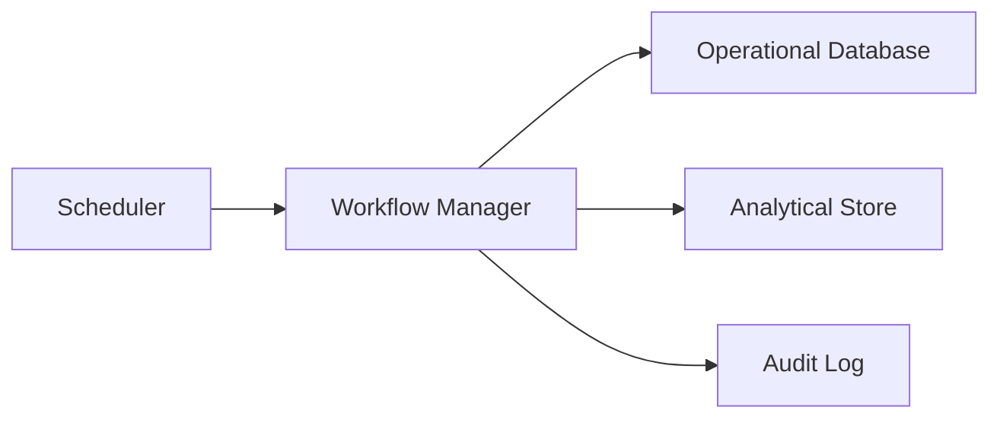

## Change data capture
**Use when:** Changes from an Operational Database must be propagated to downstream consumers without coupling the transaction path to each consumer.
**Avoid when:** A consumer only needs periodic historical reporting; use Batch ETL for that analytical refresh instead.
**Minimal logical blocks:** Operational Database, Event Bus, Core Domain Service, and downstream projection components.
**Variants:** Projection to Analytical Store; Search Index update; partner event through Integration Adapter.
**Trade-offs:** Change propagation decouples consumers and reduces synchronous dependencies, but downstream views are eventually consistent and require reconciliation.
**Failure / operational notes:** Treat the Operational Database as authoritative, publish changes as durable domain facts, and ensure consumers can deduplicate or replay delayed deliveries without changing the business outcome twice.
**Discovery questions:** Which changes are meaningful domain facts, who owns the event contract, which consumers need replay, and what lag is acceptable for each projection?
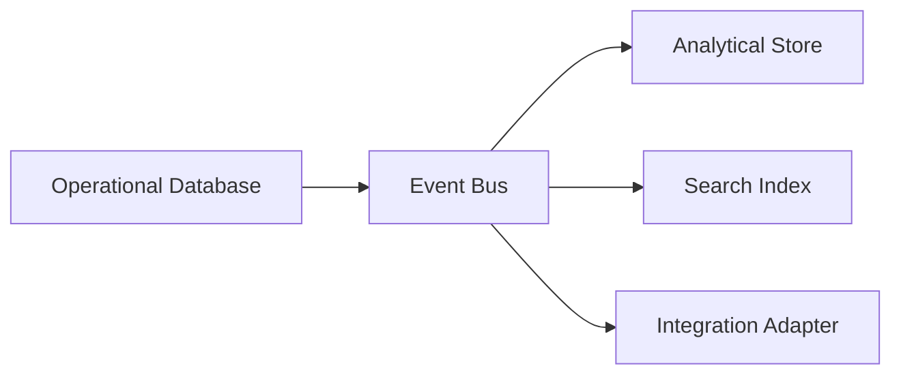

## Search / indexing
**Use when:** Users or services need discoverable retrieval with ranking, filtering, or text-oriented lookup over a governed corpus.
**Avoid when:** The goal is temporary reuse of a known response; use Cache for that responsibility instead.
**Minimal logical blocks:** Object Storage or Operational Database, Event Bus, Search Index, and Core Domain Service.
**Variants:** Document indexing from Object Storage; change-driven index updates; a read-oriented API through Backend for Frontend.
**Trade-offs:** An index improves retrieval experience and isolates search workload, but it is a derived view that can lag its authoritative source.
**Failure / operational notes:** Keep the source of record outside the Search Index, monitor indexing gaps, and provide replay or reconciliation for missed updates rather than treating the index as transactional truth.
**Discovery questions:** What content is searchable, which filters and access controls apply, what freshness is needed, and how will stale or missing index entries be reconciled?
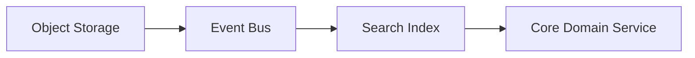

## Real-time streaming
**Use when:** Multiple consumers need near-real-time reactions to a continuous sequence of domain facts or measurements.
**Avoid when:** A producer assigns one work item to one designated worker; use Queue rather than Event Bus for that handoff.
**Minimal logical blocks:** Event Bus, Core Domain Service, Analytical Store, and consumer components.
**Variants:** Operational notifications; analytical projections; anomaly workflows started by Workflow Manager.
**Trade-offs:** Event-driven fan-out gives independent consumers timely updates, while ordering, delayed delivery, and duplicate delivery require consumer-side resilience.
**Failure / operational notes:** Make the Queue vs Event Bus choice explicit, keep operational commands separate from published facts, and design consumers to process duplicate or late events idempotently.
**Discovery questions:** Which events require low latency, which consumers are independent, what ordering matters to the business, and how are delayed events reconciled?
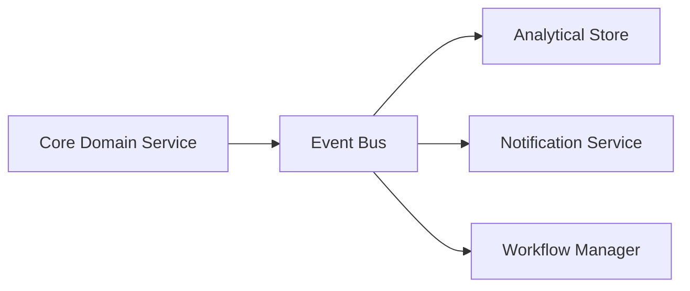

## Operational analytics
**Use when:** Teams need current operational visibility alongside historical analysis without moving transactional decisions into an analytical system.
**Avoid when:** The dashboard or analysis needs to authoritatively update a business transaction; that remains the Operational Database responsibility.
**Minimal logical blocks:** Operational Database, Event Bus, Analytical Store, and Core Domain Service.
**Variants:** Near-real-time analytical projection; scheduled aggregate refresh; operational dashboard served through Backend for Frontend.
**Trade-offs:** A separate analytical view protects the transaction path and supports broader analysis, but it introduces freshness lag and requires clear ownership of metrics.
**Failure / operational notes:** Define the boundary explicitly: Operational Database holds authoritative current state and write semantics; Analytical Store holds derived historical or aggregate views and must not become the transaction system of record.
**Discovery questions:** Which metrics require near-real-time visibility, what lag is tolerable, which source owns each metric, and which decisions must still read operational state?
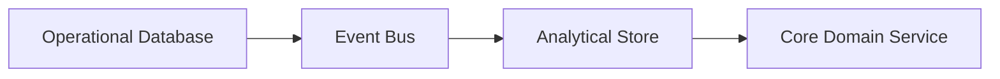

## Approval workflow
**Use when:** A business action needs a documented human decision before it can proceed, be released, or be rejected.
**Avoid when:** A deterministic policy can decide the outcome without human judgment; use Policy / Rules Service instead.
**Minimal logical blocks:** Workflow Manager, Human Review, Core Domain Service, Operational Database, and Audit Log.
**Variants:** Multi-stage approval; policy-assisted routing; approval initiated by an event or a user request.
**Trade-offs:** Human approval increases control and accountability, but adds latency, queues of work, and clear ownership requirements.
**Failure / operational notes:** Persist the authoritative workflow state, record each decision in Audit Log, and ensure resumed or repeated review actions cannot advance the same business action twice.
**Discovery questions:** Who can approve or reject, what evidence do they need, how are escalations handled, and what outcome remains if no decision arrives?
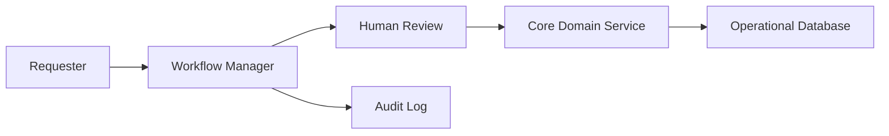

## Audit trail
**Use when:** Material business actions, decisions, or access events must be traceable for investigation, compliance, or operational accountability.
**Avoid when:** The need is only transient diagnostic telemetry with no durable business or compliance purpose.
**Minimal logical blocks:** Core Domain Service, Identity & Access, Audit Log, and Operational Database.
**Variants:** Workflow decision audit; administrative access audit; external integration outcome audit.
**Trade-offs:** Durable event history improves traceability and investigation, but requires clear event ownership, retention, and access controls.
**Failure / operational notes:** Capture actor, action, time, subject, and outcome at the logical boundary; protect audit records from ordinary business-data mutation and reconcile any missing material events.
**Discovery questions:** Which actions are auditable, who may read the history, how long must it be retained, and which event fields prove the business outcome?
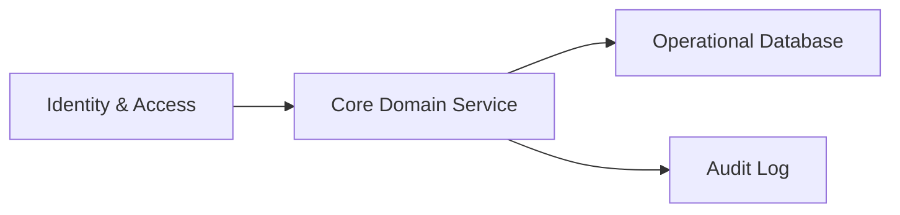

## Cache-aside
**Use when:** Read-heavy access can tolerate a boundedly stale reusable result while the authoritative source remains elsewhere.
**Avoid when:** The caller needs guaranteed current state for a transaction, authorization, or other decision that cannot tolerate stale data.
**Minimal logical blocks:** Core Domain Service, Cache, and Operational Database.
**Variants:** Read-through-like application behavior; cache invalidation from Event Bus; separate caches for distinct read models.
**Trade-offs:** Caching reduces latency and source load, but introduces staleness, invalidation responsibility, and different behavior on cache misses.
**Failure / operational notes:** Treat Cache as disposable derived state, fall back to the Operational Database on a miss, and define when changed authoritative data makes a cached value unsafe to reuse.
**Discovery questions:** Which reads are safe to reuse, what freshness is acceptable, what event invalidates a value, and what happens when the cache is unavailable?
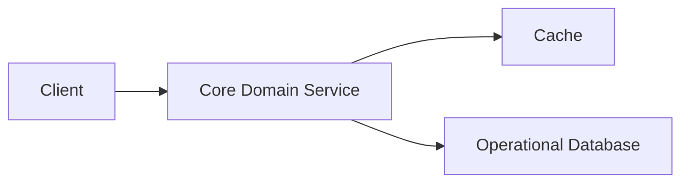

## Retry + dead-letter handling
**Use when:** Asynchronous work may fail transiently or arrive in an unusable form and needs a visible path for exhausted or exceptional items.
**Avoid when:** A synchronous request must return an immediate authoritative result and cannot safely be retried later.
**Minimal logical blocks:** Queue, Workflow Manager, Core Domain Service, DLQ → Review, and Human Review.
**Variants:** Event consumer failure handling; integration delivery recovery; reprocessing after human correction.
**Trade-offs:** Deferred handling improves resilience and protects the main flow, but creates eventual completion and an operational queue that must be owned.
**Failure / operational notes:** Keep retry behavior at the logical outcome level, preserve enough context for diagnosis, route exhausted work to DLQ → Review, and only reprocess after confirming the action is safe to repeat.
**Discovery questions:** Which failures are transient, who owns the review queue, what information enables correction, and how is a corrected item safely returned to processing?
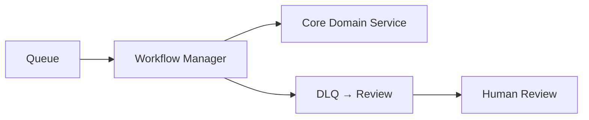

## Transactional outbox
**Use when:** A committed operational change must reliably lead to an external event or asynchronous follow-up without a gap between the two responsibilities.
**Avoid when:** No downstream consumer or external side effect depends on the operational change.
**Minimal logical blocks:** Core Domain Service, Operational Database, Event Bus, and downstream consumer components.
**Variants:** Integration Adapter subscriber; analytical projection; notification consumer.
**Trade-offs:** A durable handoff couples the business change and its publication intent, but delivery remains asynchronous and consumers must tolerate repeated events.
**Failure / operational notes:** Record the business outcome and publication intent together at the Operational Database boundary, publish the durable fact to Event Bus, and reconcile records that have not reached consumers without assuming exactly-once delivery.
**Discovery questions:** Which committed facts must be published, who owns the event contract, how are unpublished records detected, and which consumers need replay?
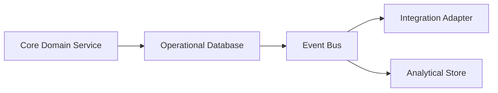

## Idempotent consumer
**Use when:** A consumer can receive the same command or event more than once and must protect the business outcome from duplicate processing.
**Avoid when:** The interaction is purely informational and duplicate display has no material effect; still document the delivery expectation.
**Minimal logical blocks:** Event Bus or Queue, Core Domain Service, Operational Database, and Audit Log.
**Variants:** Event subscriber; webhook receiver; reprocessing consumer after DLQ → Review.
**Trade-offs:** Idempotency makes at-least-once delivery safe for business outcomes, but requires a stable business identity and durable recognition of prior handling.
**Failure / operational notes:** Use an idempotency key or event identity at the business boundary, persist the handling outcome in the Operational Database, and record duplicate or rejected processing in Audit Log where material.
**Discovery questions:** What identifies the business action, how long must duplicate recognition last, which effects must occur once, and how are conflicting repeats handled?
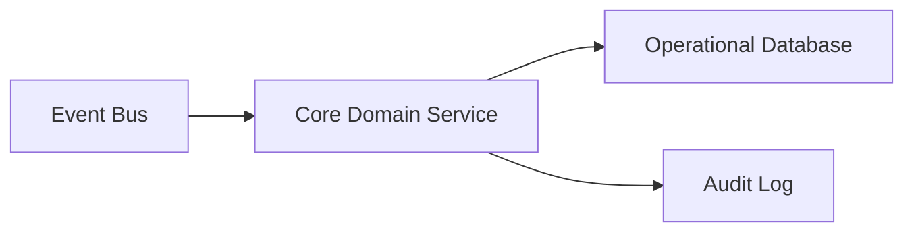

## Active-passive recovery
**Use when:** A critical business capability needs a clear recovery posture in which one logical serving path is active and a standby path can restore service after a major failure.
**Avoid when:** The capability can tolerate manual restoration or does not justify a separate standby operating posture.
**Minimal logical blocks:** API Gateway / Edge, Core Domain Service, Operational Database, Audit Log, and operational recovery ownership.
**Variants:** Standby service path; controlled failover for read access; recovery workflow with explicit business validation.
**Trade-offs:** A standby path can reduce outage impact, but creates ongoing readiness, data-recovery, and failover-governance responsibilities.
**Failure / operational notes:** Define the recovery outcome and authority to switch paths, validate the restored business state before resuming writes, and capture failover and recovery decisions in Audit Log without prescribing infrastructure topology.
**Discovery questions:** Which business capability needs continuity, what recovery outcome is acceptable, who authorizes failover, and how is data correctness confirmed before service resumes?
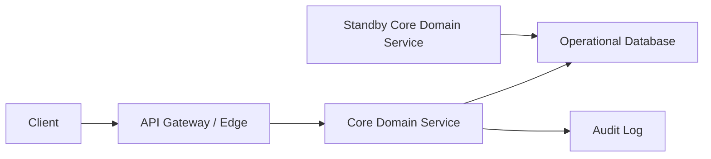
