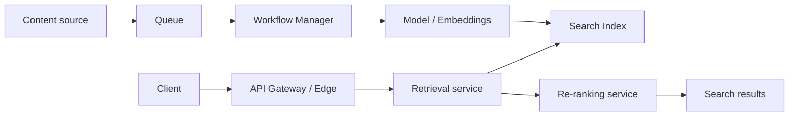
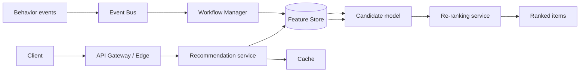
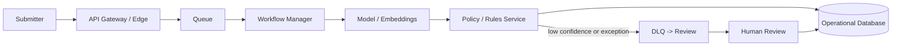
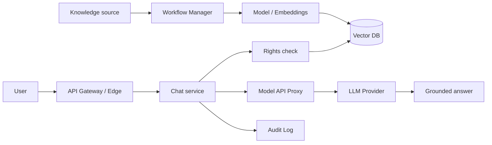
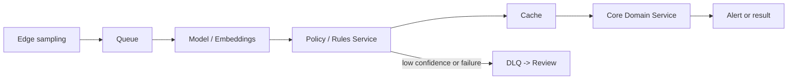
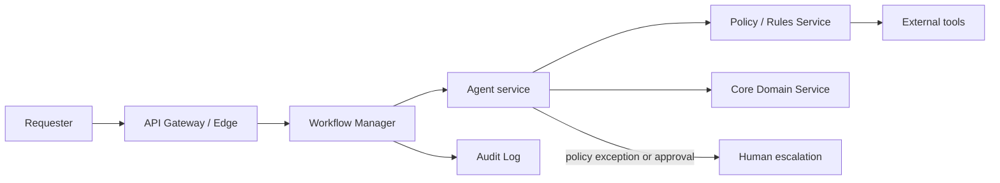

# ML and AI Patterns

Use these vendor-neutral pattern cards to select logical building blocks for
ML and AI workloads. Keep model, index, and feature artifacts as derived
products with an explicit owner, freshness expectation, and recovery path.

## Search
**Use when:** Users issue ad-hoc queries against a governed corpus and expect
ranked, relevant results within a bounded latency budget.
**Avoid when:** The request is a known-key lookup or a transactional decision;
use an operational read model or Core Domain Service for those responsibilities.
**Minimal logical blocks:** Ingestion source, Queue, Workflow Manager,
Model / Embeddings, Search Index, API Gateway / Edge, and Re-ranking service.
**Variants:** Keyword-only retrieval; hybrid keyword and vector retrieval;
semantic re-ranking; rights filtering before result return.
**Trade-offs:** The Indexing -> Serving split makes corpus preparation and query
latency independently manageable, but serving can return results that lag the
authoritative source while indexing catches up.
**Failure / operational notes:** Treat the Search Index as a derived view,
monitor indexing backlog and freshness, preserve enough source identity to
rebuild it, and define a degraded response when the index or re-ranker is
unavailable.
**Discovery questions:** Which content is searchable, what freshness and query
latency are acceptable, which filters or access rules apply, and how are stale
or missing entries reconciled?

## Recommender
**Use when:** The system must rank a personalized set of items from user,
item, and session context.
**Avoid when:** Every user should receive the same deterministic ordering or a
business policy alone determines eligibility.
**Minimal logical blocks:** Event Bus, Workflow Manager, Feature Store,
candidate-generation Model / Embeddings, API Gateway / Edge, Re-ranking
service, and Cache.
**Variants:** Batch feature refresh; streaming feature updates; candidate
generation from a catalog; business-rule filtering before ranking.
**Trade-offs:** The offline feature and candidate indexing path keeps online
serving fast, but personalization can be stale and requires clear ownership of
feature freshness and feedback quality.
**Failure / operational notes:** Separate offline feature preparation from
online serving, retain a safe non-personalized fallback, monitor training and
serving feature skew, and make exposure and feedback events attributable.
**Discovery questions:** What user and item signals are permitted, how fresh
must personalization be, what fallback is acceptable, and which outcomes prove
that a recommendation was useful?

## Content moderation
**Use when:** Submitted text, images, audio, or video must be classified before
publication or downstream use, with uncertain or violating content handled
explicitly.
**Avoid when:** A deterministic validation rule is sufficient and no semantic
interpretation or confidence-based decision is required.
**Minimal logical blocks:** API Gateway / Edge, Queue, Workflow Manager,
Model / Embeddings, Policy / Rules Service, Operational Database, DLQ ->
Review, and Human Review.
**Variants:** Synchronous pre-publication screening; asynchronous post-publication
review; multiple modality-specific models; jurisdiction- or tenant-specific
policy thresholds.
**Trade-offs:** Automated screening improves scale and consistency, but false
positives and false-negatives require calibration, appeal handling, and an
operationally owned review queue.
**Failure / operational notes:** Keep policy thresholds separate from model
scores, persist the decision and evidence needed for appeal, bound retries, and
route low-confidence, failed, or contested cases to review without silently
publishing them.
**Discovery questions:** Which content types and harms are in scope, what may
be blocked automatically, who reviews edge cases, what appeal path is required,
and what decision latency is acceptable?

## RAG / GenAI chatbot
**Use when:** Users need conversational answers grounded in governed internal
or external knowledge, with cited context and controlled access.
**Avoid when:** A deterministic transaction, policy decision, or exact system
of-record answer is required; use a Core Domain Service or Policy / Rules
Service for that outcome.
**Minimal logical blocks:** Content source, Workflow Manager, Model /
Embeddings, Vector DB, API Gateway / Edge, Rights check, Model API Proxy, LLM
Provider, and Audit Log.
**Variants:** Retrieval with citations; hybrid search; tenant-scoped knowledge
bases; tool calls delegated to a separate bounded agentic workflow.
**Trade-offs:** Indexing knowledge separately from answer serving keeps the
chat path responsive and refreshable, but retrieval freshness, prompt size,
and model variability remain material product and cost constraints.
**Failure / operational notes:** Enforce rights before context reaches the
model, preserve source and index version with each answer, set timeouts and
fallbacks for the model provider, and log prompts, tool decisions, and outputs
according to data-handling policy.
**Discovery questions:** Which sources are authoritative, how fresh must they
be, what identities and rights constrain retrieval, what answer evidence is
required, and which requests must never leave the controlled boundary?

## Real-time CV
**Use when:** A stream of camera or sensor frames needs low-latency detection,
classification, or tracking, with explicit treatment of uncertain results.
**Avoid when:** Frames can be assessed offline without a real-time operational
decision or alerting need.
**Minimal logical blocks:** Edge sampling, Queue, Model / Embeddings,
Policy / Rules Service, Cache, downstream Core Domain Service, and DLQ ->
Review.
**Variants:** Edge inference with cloud escalation; central inference; sampled
frame retention; human verification for safety-critical or low-confidence
detections.
**Trade-offs:** Edge or near-edge serving reduces response latency and network
load, while central processing simplifies model updates but adds connectivity,
bandwidth, and privacy dependencies.
**Failure / operational notes:** Define frame sampling, retention, and privacy
boundaries; monitor model drift and camera health; use confidence and policy
thresholds separately; and retain only the evidence needed to investigate
material alerts.
**Discovery questions:** What latency and detection quality are required, where
may inference run, which detections trigger an action, how are false alarms
handled, and what image retention or residency constraints apply?

## Agentic workflow
**Use when:** A bounded, tool-using, multi-step task needs contextual planning,
controlled iteration, and observable handoffs between tools or people.
**Avoid when:** A deterministic transaction flow, fixed policy decision, or
simple service call can produce the outcome; an agent is not the default for
those paths.
**Minimal logical blocks:** API Gateway / Edge, Workflow Manager, Agent service,
Policy / Rules Service, external tools, Audit Log, and Core Domain Service
where a business outcome must be recorded.
**Variants:** Read-only research agent; approval-gated action agent; retrieval
augmented agent; human escalation for low confidence, policy exceptions, or
irreversible actions.
**Trade-offs:** An agent can adapt a bounded plan to contextual work, but it
adds non-determinism, latency, evaluation effort, and tighter controls over
tool scope, cost, and side effects.
**Failure / operational notes:** Define the allowed tools, input and output
schemas, maximum steps, time and cost budgets, stop conditions, and idempotent
business-action boundary; enforce policy before each tool call and retain an
Audit Log of the plan, tool inputs, outputs, and final result.
**Discovery questions:** What objective cannot be expressed as a deterministic
flow, which tools may be used or mutate state, what boundaries and budgets
apply, what requires approval, and how is a failed or partial outcome made
safe?

