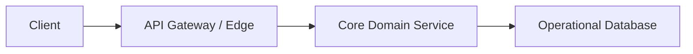
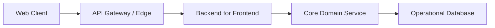
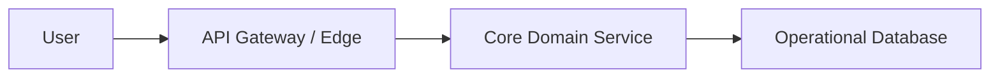
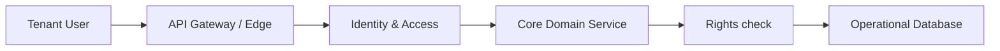
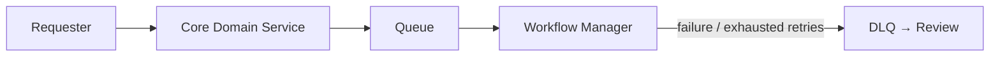
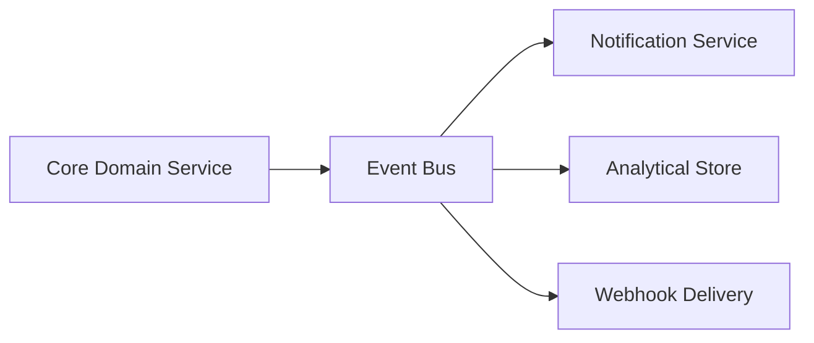
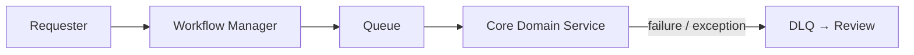
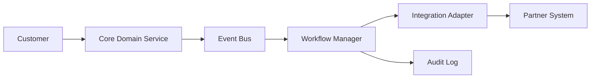
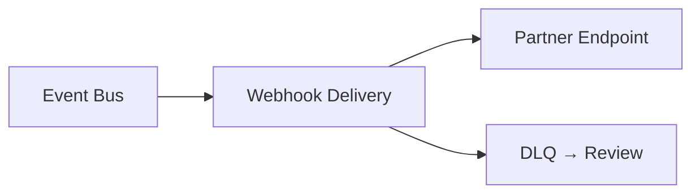
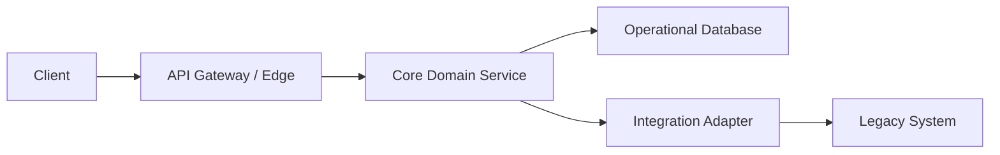

# Product and Integration Patterns

Use these vendor-neutral pattern cards to select logical building blocks for
product/API and integration concerns. The Mermaid sketches show a minimal
starting shape; add components only when the stated concern is in scope.

## API-first backend
**Use when:** Several clients or partners need a stable, governed contract before their implementations are known.
**Avoid when:** A single private consumer can use a short-lived internal contract without creating an API product.
**Minimal logical blocks:** API Gateway / Edge, Core Domain Service, and Operational Database.
**Variants:** A versioned public API; an internal API behind the edge; a read-oriented API backed by Search Index.
**Trade-offs:** A stable contract improves reuse and change control, but versioning and compatibility obligations slow interface change.
**Failure / operational notes:** Apply authentication, rate limits, input validation, and observability at the edge; make retried write requests idempotent.
**Discovery questions:** Who consumes the API, which changes must remain compatible, and which operations require idempotency?

## Backend for Frontend
**Use when:** A web, mobile, or partner experience needs a tailored contract or response composition.
**Avoid when:** All clients can efficiently use one general API without client-specific aggregation or adaptation.
**Minimal logical blocks:** API Gateway / Edge, Backend for Frontend, and Core Domain Service.
**Variants:** One BFF per client family; a BFF with a cache; a BFF that starts an asynchronous workflow.
**Trade-offs:** Client-specific APIs improve usability and latency, but duplicate composition logic and more deployable services increase maintenance.
**Failure / operational notes:** Keep domain invariants in Core Domain Service, set timeouts for composed calls, and prevent a BFF from becoming a second domain layer.
**Discovery questions:** Which client journeys differ, what data must be composed, and what latency budget does each experience have?

## Modular monolith
**Use when:** The product needs strong domain boundaries and independent evolution without the operational cost of distributed services.
**Avoid when:** Teams require independent scaling, deployment, or failure isolation that cannot be provided inside one runtime boundary.
**Minimal logical blocks:** API Gateway / Edge, Core Domain Service, and Operational Database.
**Variants:** Modules publish internal domain events; selected modules later expose Event Bus integration; read modules use Search Index.
**Trade-offs:** In-process calls simplify transactions and operations, but shared deployment can couple release cadence and resource scaling.
**Failure / operational notes:** Enforce module ownership of data and interfaces; do not let direct cross-module database access replace explicit domain contracts.
**Discovery questions:** Which capabilities change together, where are transactional boundaries, and which module might need independent extraction later?

## Multi-tenant SaaS
**Use when:** One product serves multiple customer organizations while preserving tenant-specific access, data, and configuration boundaries.
**Avoid when:** Each customer requires a separately operated system with no shared product or operational plane.
**Minimal logical blocks:** API Gateway / Edge, Identity & Access, Core Domain Service, Rights check, and Operational Database.
**Variants:** Shared data with tenant keys; isolated data stores; tenant-specific policy through Policy / Rules Service.
**Trade-offs:** Shared infrastructure lowers unit cost and speeds delivery, while stronger tenant isolation increases operational and data-management complexity.
**Failure / operational notes:** Propagate tenant context on every call, enforce it at data access and Rights check, and test for cross-tenant leakage.
**Discovery questions:** What isolation level is required, where is tenant context established, and can tenants have distinct retention or residency needs?

## Asynchronous job processing
**Use when:** Work is long-running, bursty, retryable, or need not finish on the request path.
**Avoid when:** The caller needs an immediate, strongly consistent outcome and the work fits within the synchronous latency budget.
**Minimal logical blocks:** Core Domain Service, Queue, Workflow Manager, and DLQ → Review.
**Variants:** A scheduled batch initiated by Scheduler; a workflow with Human Review; a job that publishes a completion event.
**Trade-offs:** Queues absorb bursts and isolate failures, but introduce eventual consistency, status tracking, and retry-safe processing requirements.
**Failure / operational notes:** Include idempotency keys, bounded retries, visibility into job state, and a DLQ → Review path for exhausted work.
**Discovery questions:** What may complete later, how will callers observe status, and what is safe to retry or compensate?

## Event-driven fan-out
**Use when:** Multiple independent consumers must react to the same domain fact without the publisher knowing each consumer.
**Avoid when:** One designated consumer owns a work item; use Queue for that point-to-point handoff.
**Minimal logical blocks:** Core Domain Service, Event Bus, and independent subscriber components.
**Variants:** Analytics projection to Analytical Store; notifications through Notification Service; partner callbacks through Webhook Delivery.
**Trade-offs:** Choreography makes subscribers independently extensible, while an orchestrator gives one place to visualize process state but adds central coordination.
**Failure / operational notes:** Consumers need idempotency, durable event handling, schema evolution rules, and replay or reconciliation procedures for delivery gaps.
**Discovery questions:** Which facts are published, who owns event schemas, and can every subscriber process duplicate or delayed delivery?

## Workflow orchestration
**Use when:** A multi-step business process needs explicit sequencing, state, retries, timeouts, or human intervention.
**Avoid when:** Independent reactions to a fact are sufficient and no process-wide state or coordination is required.
**Minimal logical blocks:** Workflow Manager, Core Domain Service, Queue, and DLQ → Review.
**Variants:** Scheduled workflows from Scheduler; human decision points with Human Review; event-triggered workflows from Event Bus.
**Trade-offs:** Orchestration improves visibility and controlled compensation, while choreography reduces central coupling but makes end-to-end process reasoning harder.
**Failure / operational notes:** Persist workflow state, make each step idempotent, define timeout and retry policies, and route terminal failures to DLQ → Review.
**Discovery questions:** What is the authoritative process state, which steps can run in parallel, and where must a person approve or correct work?

## Saga
**Use when:** One business outcome spans multiple services or external systems without a shared transaction and requires compensating actions.
**Avoid when:** A single Core Domain Service can enforce the whole transaction atomically in its Operational Database.
**Minimal logical blocks:** Core Domain Service, Event Bus, Workflow Manager or Integration Adapter, and Audit Log.
**Variants:** Orchestrated saga led by Workflow Manager; choreographed saga through Event Bus; partner step through Integration Adapter.
**Trade-offs:** Orchestration centralizes compensation decisions and visibility; choreography reduces a coordinator dependency but distributes ordering and recovery reasoning among participants.
**Failure / operational notes:** Record correlation IDs and state transitions, make commands and compensations idempotent, and define how to reconcile a permanently failed participant.
**Discovery questions:** Which steps commit independently, what compensates each step, and who owns the final business outcome when compensation is incomplete?

## Webhook integration
**Use when:** An external system needs near-real-time notification of a domain event through a registered endpoint.
**Avoid when:** The recipient needs rich bidirectional translation or the integration is a human notification rather than a system callback.
**Minimal logical blocks:** Event Bus, Webhook Delivery, DLQ → Review, and an external endpoint.
**Variants:** Webhooks initiated directly by Core Domain Service; signed callbacks; per-partner delivery policies.
**Trade-offs:** Push delivery reduces recipient polling and latency, but external endpoint availability and retry behavior make delivery eventual rather than transactional.
**Failure / operational notes:** Sign and authenticate callbacks, use idempotency and event identifiers, retry with backoff, and retain failed deliveries in DLQ → Review.
**Discovery questions:** What delivery guarantee is required, how will the recipient deduplicate callbacks, and how are endpoint secrets rotated?

## Legacy strangler
**Use when:** A legacy capability must be replaced incrementally while preserving business continuity and a controlled migration path.
**Avoid when:** The legacy system can be retired in one low-risk cutover or no stable boundary can be established around the capability.
**Minimal logical blocks:** API Gateway / Edge, Core Domain Service, Integration Adapter, and Operational Database.
**Variants:** Route selected requests to the new domain service; mirror changes through Event Bus; translate legacy contracts with Integration Adapter.
**Trade-offs:** Incremental replacement reduces cutover risk and enables learning, but parallel paths, data synchronization, and rollback support extend migration complexity.
**Failure / operational notes:** Define routing criteria and rollback, reconcile data between old and new paths, and audit every migration decision until the legacy path is retired.
**Discovery questions:** Which capability can be carved out first, what data must stay synchronized, and what measurable condition permits retiring the legacy route?

