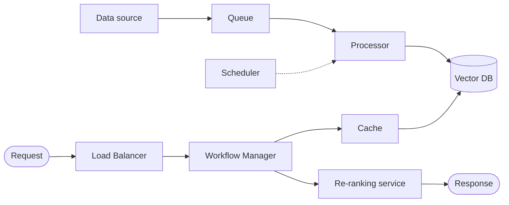
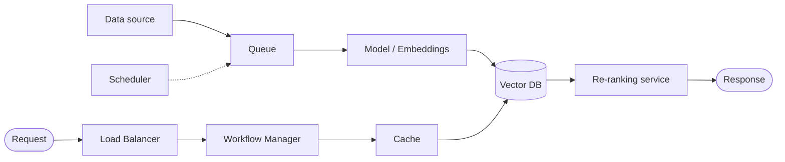
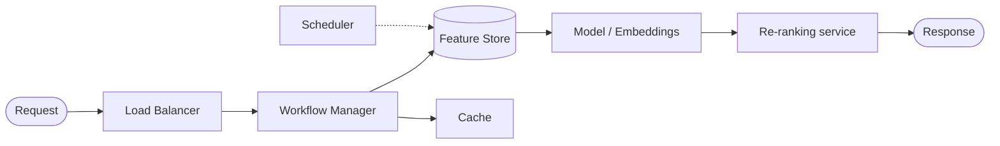
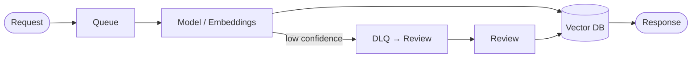
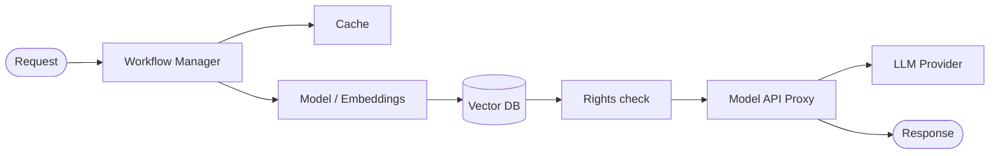
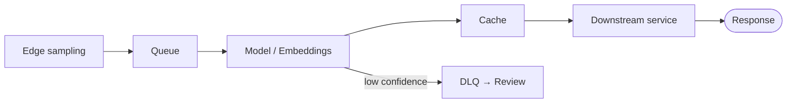

# Patterns

## Master pattern: Indexing ↔ Serving
Almost every ML system splits into an **offline Indexing/Ingestion pipeline**
(prepares data/embeddings/features) and an **online Serving pipeline**
(answers requests). Draw ingestion left→right into a shared store; draw the
request entering from the right through the `Load Balancer`.

## Search
Use when users issue ad-hoc queries against a large, mostly-static corpus and expect ranked, relevant results back within a tight latency budget.

**Block set:** `Queue`, `Scheduler`, `Model / Embeddings`, `Vector DB`, `Cache`, `Load Balancer`, `Workflow Manager`, `Re-ranking service`.

## Recommender
Use when the system must rank a personalized set of items per user, combining online context with precomputed offline features and candidates.

**Block set:** `Feature Store`, `Scheduler`, `Cache`, `Load Balancer`, `Workflow Manager`, candidate-generation `Model / Embeddings`, `Re-ranking service`.

## Content-moderation
Use when incoming content must be scored automatically and low-confidence or violating items routed to a human reviewer before publishing.

**Block set:** `Queue`, `Model / Embeddings`, `DLQ → Review`, storage (`Vector DB`/metadata), publish/review branch.

## RAG / GenAI chatbot
Use when responses must be grounded in retrieved context and generated by an LLM, with per-user access control enforced on retrieved results.

**Block set:** `Model / Embeddings`, `Vector DB`, `Rights check`, `Model API Proxy`, `Workflow Manager`, `Cache`.

## Real-time CV
Use when a stream of edge-captured frames must be classified or scored with low latency, and uncertain detections escalated for human review.

**Block set:** edge sampling → `Queue`, `Model / Embeddings`, `Cache`, `DLQ → Review`, downstream service.

