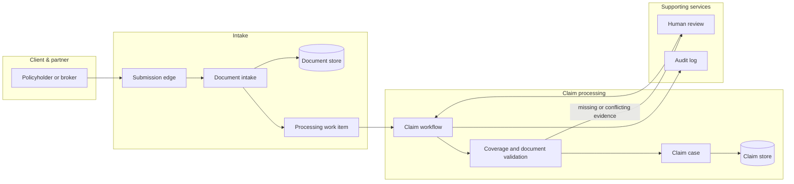

# Visual smoke example: insurance document intake

Use this as a visual-quality baseline for a compact Mermaid HLD. It shows the
workshop insurance document-intake scenario, not a reusable insurance-domain
template.

- The primary flow moves from a policyholder or broker through intake and
  claim processing, left to right.
- `Human review` is the single exception branch and is kept separate from the
  happy path.
- `Audit log` is a supporting service; document and claim storage sit beside
  the services that own them.
- Edge labels appear only where the validation result changes the processing
  mode. Retry, retention, and notification behavior belongs in prose.

The expected composition is four containers, one left-to-right Mermaid view, eleven
logical boxes, one exception branch, and separately grouped supporting
services.
